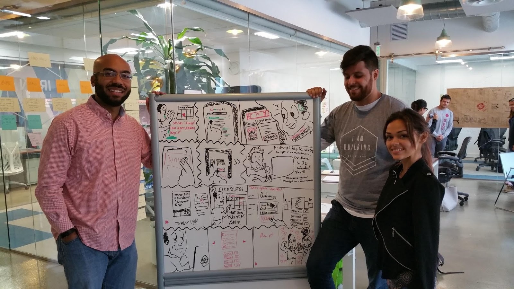
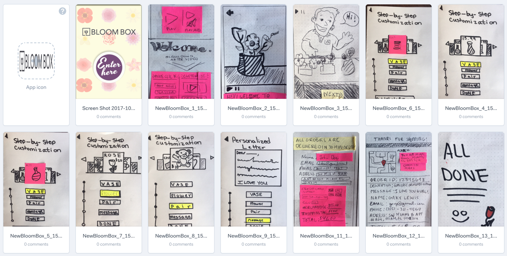

# Bloombox

{{ page.summary }}

**Processes:** Design Sprint, Design Systems, Interaction Design
**Tools:** Sketch, Flinto
**Technologies:**
**Designed For:** Native Mobile

## Bloombox in Three Parts

I decided to update this project in January 2019 by designing it in a higher fidelity, building it out in a design system and then going a step further and building out the interactions.

- Part One — [The Design Sprint](#part-one-the-design-sprint), November 2017
- Part Two — [Building the Design System](#part-two-building-the-design-system), January 2019
- Part Three — [Exploring Interaction Design](#part-three-exploring-interaction-design), January 2019

**In Part One**, I highlight what can be accomplished in a five-day [design](http://www.gv.com/sprint/) [sprint](https://designsprintkit.withgoogle.com/).

**In Part Two**, I discuss how I begin to approach constructing a design system in Sketch:

**In Part Three**, I discuss how I approach interaction design in Flinto:

Here's a close-up of one of the interactions while still in experimental phase:

And here's the end result:

## Part One: The Design Sprint

*You might be wondering why I've included a low-fidelity prototype in my portfolio.*

I wanted to highlight what can be accomplished in a five-day [design](http://www.gv.com/sprint/) [sprint](https://designsprintkit.withgoogle.com/) while also spotlighting the process with all the 'pretty' parts stripped away.

### TL;DR

- Through the Design Sprint framework of Map, Sketch, Decide, Prototype and Test, we researched, prototyped and tested [Bloom Box](https://www.bloomboxmiami.com/)’s website in five days.
- BloomBox was ‘seeing **a large drop-off rate once the users got to the product page and tried to customize their Bloom Box**’.
- Based on our research, our solution limited cognitive overload by presenting only essential data through a pictorial, rather than text heavy, user interface. We also ensured user flow was as streamlined as possible and Bloombox’s existing social media marketing (Instagram, Facebook) had multiple points for onboarding to the main site.
- Iterations across multiple media and throughout the process provided unique insight, while revisiting the project brief ensured the client’s and more importantly their user’s goals, needs and pain points were front and center across our entire process.

### Introduction

Over the course of a week, a team consisting of me and two colleagues proposed a redesign of a regional flower shop’s online purchasing experience. Through the Design Sprint framework of Map, Sketch, Decide, Prototype and Test, we researched, prototyped and tested [Bloom Box](https://www.bloomboxmiami.com/)’s website in five days.

Our task was clear: BloomBox was ‘seeing **a large drop-off rate once the users got to the product page and tried to customize their Bloom Box**’. They wanted the shopping experience to be as simple, fresh, and fun as their flower boxes were.

### Mapping — Day One

The first step in the process is to map out the existing user experience. We first conducted user research by analysing surveys and quantitative data.

With five interview transcripts and 51 survey respondents, we noted demographics, user needs, and pain points and came away with key pointers with which to establish a target user — a persona towards which we could orient our design process. Why?

> Designing for everyone is designing for no one.

*How* we did this was not complicated: drill through the data and find common themes. Users reported freshness, personableness and product availability as important. We chose to target **males, 25–34 because they were 35% of Bloom Box’s users at large and were 75% of the survey respondents**. Moreover, this is a demographic Bloom Box can grow with.

An interesting takeaway at this point was that some in our team were more oriented towards qualitative analysis while others were drawn to the user interviews. With any research, it’s easy for [confirmation bias](https://en.wikipedia.org/wiki/Confirmation_bias) to affect even a methodical process and we can contaminate the results through our analysis if not through the data collection itself. Best practices encourage us to let the data do the talking: quantitative data should be used to mine the qualitative, and vice versa.

> If an interesting story is not backed up by data, it’s not that interesting. If the data is not captured in your interviews, it’s best to take a second look at that data.

We next mapped out pain points that users (customers) might have with the current experience based on our own navigation of their site informed by our research.

### HMWs (How Might We’s)

With a good bit of insight, it was time to begin thinking up solutions…. Wrong!! [I had you there for a second, huh? :-)] . As we transitioned into ideation, the key was in not trying to think up solutions too quickly. First of all, a user experience designer doesn’t *think up* solutions out of thin air — that’s not UX. There is however plenty of creativity involved; the trick is to have that creativity driven by the research.

If user experience design is cooking, the ingredients would be the research. Asking “How Might We” questions would be the first step in the recipe, something akin to getting the pan hot. ‘How might we…begin to address a user’s pain points’. If a user thinks the checkout process is too complicated, a ‘How Might We’ is not “add a checkout car on the home page”. A ‘How Might We’ is ‘simplify the checkout process’:

### Lightning Demo Presentations

Next, we compared the offerings and features of direct and indirect competitors to dig deeper into user pain points, needs and our How Might We’s. Blindly copying a feature will likely lead you down a path in the wrong direction, but taking what works elsewhere, applying it to the current situation, and then improving on top of that, is a win-win-win.

We came away with a map of target event features we could implement:

- Limit cognitive overload
- Star rating system
- More prominent pricing and product availability. More visible product options.
- More customer feedback and/or live chat
- Clear error messaging

Next, we stopped to review the project brief.

> It’s important to revisit your client’s goals and their user’s needs and problems often.

For this project, we had forgotten why Instagram was a starting point of our customer map and remembered that BloomBox marketing was heavily focused on Facebook and Instagram. Instagram was a pain point and dead end in the map because there were no links back to product pages from specific Instagram posts.

### Sketching — Day Two and Three

#### Sketchnoting and Crazy 8's

Next we ideated three times in close succession:

- We sketchnoted, or put ideas down on paper pictorially, to help creativity flow. You can often communicate your ideas better when drawn.
- Crazy 8 iteration #1: 5 minutes to put down eight ideas (40 seconds each).
- Crazy 8 iteration #2: We reviewed each other's crazy 8 ideas (24 ideas total) and then went back at again for another 5 minutes and 8 ideas. One of my key takeaways here was that I combined two of my previous ideas into a single, better idea during this phase.

Although it might be frowned upon as a keep-your-email-inbox-clean best practice, touching ideas multiple times in different ways is one of the great benefits of a design sprint and user experience design as a whole.

> By not taking the time to move through the design process step by step after thorough user research, you’re probably putting down some nice things you saw on some website, rather than innovative ideas applied to your client’s and their user’s specific context.

**Sketchnoting:** Getting ideas down pictorially helps creativity flow.

**Crazy 8s** — First Iteration

**Crazy 8s** — Second Iteration

#### Speed Critique

Now we took the time, first on our own, to design a solution based on all of the research, feedback and ideation we’d done so far:

We set up a solution gallery (think art gallery) of different ideas and highlighted (with dots) ideas that we liked. This created a heatmap of sorts where the best ideas rose to the surface.

### Deciding — Day Three

#### Storyboarding

Now on day three, it was time to put those best ideas into a storyboard that captured the current user flow (with pain points) to see where those ideas might best be applied. Thanks to Jorge’s handiwork, the result looked great:

Storyboarding helped us finalize which solutions we’d implement and further refine our customer map.

It’s important to clarify the user’s thoughts and emotions being conveyed in each board before jumping into the actual sketching.

### Day Four — Prototyping

*We’re really iterating now!*

The best way to describe the benefits of paper prototyping, is by showing you the two prototype iterations below:

#### Iteration #1

#### Iteration #2

- Our aim was clear: with the groundwork laid through research and ideation, it was time to prototype, first through hand drawn sketches.
- Using the Marvel app, we created a mobile, interactive version of the paper prototypes.
- Before testing outside of the bootcamp, we sought feedback from our instructors and colleagues.

As just shown, we were able to immediately improve our prototype based on early feedback. **Since they were done in paper, making changes was quick and we weren’t too attached to resist the changes.**

The Marvel App in action: A clickable, linkable prototype on a mobile device. You use the app to take a picture of your paper prototype and then select an area of the page to create a clickable link to another prototype screen you’ve created. Quick and insightful!

Our final screens, ready for Day 5 User Testing!:

### Day 5 Part One — User Testing

“Why isn’t it moving to the next thing when I clicked the thing.”

I first interviewed a friend of mine that was in our target demographic, especially considering his experience with ordering things online. Before even beginning testing, I gained feedback by his noting that he doesn’t like to order things on his phone often because he’s worried about making mistakes based on past experience. A full screen desktop experience provides him with more space to review and click.

Another takeaway was that due to issues on his end, it took 20 minutes just to get the test started as we conducted the test via internet. (He was on a friend’s computer and could not remember his log-in information to join the Google Hangout session I had created to conduct the test via video and audio.) I ended up creating a work around by sending an invite through a different conferencing service, Zoom and will remember to have multiple platforms and pathways available when interviews are not conducted in person.

A final great piece of insight from this interview was that he wanted to see an “are you sure?” (as he described it) page after placing an order before it was 100% ordered. That way he could correct any errors. It’s a feature we three had all used before, but did not pick up on during our research, competitive analysis and ideation as we were juggling so many different ideas and features. User feedback is great since you’re not just depending on your own ideas or even your own memory.

### Day 5 Part Two — User Testing

Now it was time to take our prototype to the streets!

Since we were working out of the fantastic tech coworking space Building.co in downtown Miami’s Brickell neighborhood, we hit the pavement and sought out a local coffee shop to find additional users to test our prototype.

One of the key learnings here is was that not everyone has the time or interest to be a tester. (After this experience, I gained **a lot** more empathy for those sidewalk marketers.) However, when you find someone interested, it can often be an excellent experience, both as a designer and as a human being.

We met a middle aged gentleman named Jeff who provided really great insights since he ordered flowers online often. He wanted to see multiple location checkpoints for deliveries, where you could pick the flowers up on your way home from work. We hadn’t considered an operational feature like that as well as several of his other ideas: “add a back button there”, for example. He even came back 5 minutes after we had finished testing with him to give us some more pointers.

Jeff, if you’re out there reading this, thanks!

We pooled all of our insight together and then pitched our ideas:

This concluded the five day design sprint.

With more time and the resources to begin implementing our solutions; we’d move our prototype from low/mid fidelity to high fidelity and begin connecting our prototype to existing front-end and back-end client systems.

### Key Takeaways

- In a design sprint — and in the wider world of design in general — it’s easy to start thinking up solutions too early when the problem needs to be further explored.
- 85% of usability experiences are discovered when researching and/or testing five users. Don’t believe me? [Don Norman told you so.](https://www.nngroup.com/articles/why-you-only-need-to-test-with-5-users/)
- Trust the process. Without taking the time to do proper research and all of the necessary steps to break down the ideation phase, you’re not doing UX design. You’re just making things look pretty and they probably won’t be that pretty.

## Part Two: Building the Design System

### The Mechanics of Building a Design System (In Sketch)

This post (like all good design systems) is a work in progress. Check back later for more detail on how some of the components were put together.

### Welcome

Welcome to part two! If you want to dig in while following along, you can view and download the design system from [sketch cloud](https://sketch.cloud/s/8PmjO).

The purpose of this section of the case study — and also this portion of the project — is to explore how a design system can be utilized to improve workflows. This is not the cleanest, sexiest pixel-perfect design. This is about looking under the hood, especially when working within a team.

I am writing this for those familiar with product design and the basics of Sketch. Much of this article rests on an understanding of sketch symbols. Here’s a primer: [https://sketchapp.com/docs/symbols/](https://sketchapp.com/docs/symbols/)

### Sketch 305

Over the past year, I’ve gained so much from the monthly [Sketch 305 Meet Up](https://www.meetup.com/sketch-305/) here in South Florida. Led by [Marcelo Paiva](http://paiva.cc/), and supported by the [SOFLUX](https://www.meetup.com/SOFLUX/) community, we come together to break bread (actually fajitas though), contribute to an open source design system while learning new skills, and to give back when we can. Much of what I’ve done here would’ve been either learned or experimented with during these sessions and much of the inspiration for this project comes out of that space as well. Thanks.

### Starting Off

This Bloombox project was a mobile commerce redesign. A design system made sense because I expected a large number of objects that would need to be reused across multiple screens and that might change over time.

A product image may be updated or the product itself may be swapped out, and it’d be helpful to be able to change the design accordingly across multiple screens without having to make the same changes multiple times.

Here are the six screens that I ended up building in Sketch:

Notice that many of the images are duplicated. For example, see the red flower in the third and fourth screens? Look closer. See the red flower partially hidden in the first and second screens? And notice how the image is smaller?

The system I’ve built allows a designer to change that flower in one place and then be reflected in all of those places. Here’s the Symbols Page in Sketch:

The Symbols page in Sketch

Let’s look a little closer:

You’ll notice that the ‘container-style’ symbol is made up of two other symbols: ‘image’ and ‘container-style’.

The ‘container-style’ symbol is shown above. I use this to define styling of the container — mainly size, color and shadow. If I nest this ‘container-style’ symbol within multiple other symbols, I can change the style of ‘container-style’ and it will be reflected in those other symbols.

Now to the ‘image’ symbol:

The ‘image’ symbol is just an image pasted onto a symbol artboard. However, by duplicating the symbol and renaming each duplicate, I begin to see the power of Sketch symbols:

Notice how the symbols are named, for example, “image/vase/1”. This allows for override groupings.

The benefit of using symbols is that you can make changes in one place and those changes will be reflected in multiple places. But sometimes we want to make a change in only once place, while still keeping other ‘change it everywhere’ benefits.

In Sketch, overriding a symbol allows the designer to change a specific attribute of the symbol while still remaining a symbol. I can, for example, change the color of an individual instance of a symbol without changing the color of all of the symbols. And if I name and order them properly, I can pick and choose different iterations of that symbol:

By selecting the “image” overide option in the inspector (right panel in Sketch) I am able to change the nested image in this specific symbol to a different image. No cutting and pasting, no resizing, no easy errors.

It takes some time to set up on the front end, but you may begin to see how this could make life much easier in the end.

I should also make clear that the “image” override is not something preset in sketch. It’s called “image” because that’s what I called the symbols I created. What components are named and how they are nested within each other are completely custom. Sketch is smart enough to figure out how to piece them together in an easy interface to speed up my workflow. For example, notice that there was also a “container-style” override option in the image before the last.

### In Closing (For Now)

There’s much more detail to cover, but for now, I hope this is enough to get you started in exploring symbols in Sketch and perhaps perks your interest in building a design system if you weren’t interested or even aware before.

I encourage you to download the system and play around with it for yourself. Again, it’s not super pretty, but I’m really proud of how it came together. It has the structure that if I now want to update the styling, I can do so quickly and easily across multiple components and screens.

## Part Three: Exploring Interaction Design

### Building the Concept

While I was still designing the interface, I tested some of my interaction ideas. If an interaction was too difficult or time-consuming to prototype (and eventually code), I could make adjustments to the interface (how it looks) before I was committed.

This is typical in my work alongside developers. If a product improvement might better the user experience — say 10% — but doubles the design and/or development effort, it might not make sense at that time.

I found great graphic art on Behance ([Thanks Maxibon!](https://www.behance.net/gallery/58532573/Maxibon-Design-collection)) to use as placeholder images so I could focus on the most complicated interaction I had in mind. Here’s the end result:

This project provided a great opportunity to get reacquainted with [Flinto](https://www.flinto.com/). Although you can create objects like rectangles, ovals and text within the app, it’s best utilized for designing interactions and animations.

So how’d I prototype the interaction above?

I knew I wanted something similar to Apple’s [Cover Flow](https://en.wikipedia.org/wiki/Cover_Flow) interaction, but not exactly the same. After some experimentation on my own, I found a [tutorial posted by Flinto](https://www.youtube.com/watch?v=Rul9tAlQl00) on building this exact Cover Flow interaction. Just like developers, designers have the web at their disposal with all sorts of tips and tricks to improve their skills and ultimately work faster.

In my initial experimentation, I couldn’t figure out how to pull in the options from the left and right that were not on the screen initially. I thought I could do it using Flinto’s scroll feature, like this:

But, ‘no dice’.

Fortunately, what I learned through the tutorial that you can move images off-screen (off of the art-board) while they remain layers of that art-board:

Notice above, the images off-screen; to the right and left.

These off-screen images would be pulled in to the screen if the ‘item-flow’ interaction (as I’m calling it) was moving to the right or the left.

Before moving further, I’ll point out that I was able to import my in-progress designs from Sketch, which meant I didn’t have to re-create everything in Flinto. One of the downsides of the Sketch-Flinto partnership is that the files are not linked; it’s strictly export/import. Changes in Sketch after exporting to Flinto would not be reflected in the Flinto file.

### Flinto’s Transition Designer

The transition designer is a powerful tool to… er… transition from one screen to the next. In my case, I don’t want it to look like I’m moving from one screen to the next; I want it to look like I’m manipulating one interaction on a single screen. I start off with two different screens side by side, in the transition designer:

One great feature of Flinto’s transition designer is that if you keep layer names the same across screens, once you ‘connect layers’ it will connect those same layers if you copy that interaction to another screen. By ‘connect layers’, I mean for example, we designate that Object A in Screen 1 is the same as Object A in Screen 2. If Object A is in a different position on Screen 2 than it is on Screen 1, Flinto will do the hard work of figuring out how to move the object during the transition. You can then tweak that movement manually ‘till your heart’s content.

Here’s what it looks like after I connect the center image on the right screen above, to its corresponding image in the left screen:

You’ll notice that the image in the left screen has moved to the same position on the right screen, and its old position in the right screen is hidden. You’ll also notice two layers are now indicated as connected by the blue and red highlighting in the layer panel on the left.

We do the same thing with the ‘off-screen’ images — we connect something that was off-screen in one art-board to something that is on-screen in another art-board which will allow for an object to fly-in from off-screen.

### Now It’s For Real

My experiments in Flinto proved the interface and interaction designs I was pursuing were useful and doable for this project.

I finished building the design (and design system!) in Sketch, and imported it into Flinto. I built some basic interactions like scrolling and tapping:

And some more nuanced micro-interactions like the ‘popping’ animation when an item is tapped:

### The End Result

All interactions designed in Flinto

Now you might be wondering, what happened to the rest of the case study!

My intent in this part of the case study was show you how you might begin prototyping advanced interactions with a tool like Flinto.

All of the interactions and animations you see to the left were created from scratch in Flinto. See even how the price changes when a new item is selected.

There are definitely some components missing from the overall design — there’s no main menu, for example. And that’s okay for this project, for now.

There are still larger questions to test — like if the selection layout overall is usable and preferred by people or not.

The point of this portion of the case study — and of part two as well — was to explore the more technical side of design prototyping through some of the tools available today.

There are other tools out there and I look forward to sharing with you what I’m learning in [Justinmind](https://www.justinmind.com/) (I used heavily in 2018), [Adobe XD](https://www.adobe.com/products/xd.html) (I’m using heavily in 2019), [Figma](https://www.figma.com/), [Invision Studio](https://www.invisionapp.com/studio) and others.

I look forward to your hearing your feedback, tips, and tricks!
