*Originally published via Wordpress on December 28, 2017.*
*Last edit December, 2017.*

**Processes:** Lean Survey Canvas, User Research, Lean UX Canvas, Competitive Analysis, User Journey Mapping, Prototyping, User Testing, Task Analysis, User Flow Mapping, Information Architecture, Site Mapping
**Tools:** Sketch, Atom, Github, Github Pages
**Technologies:** HTML5, CSS
**Designed For:** Mobile, Web

## Project Role and Duration

This is one of two designs I completed over three weeks in November 2017. I coded the landing page during a fourth week.

## The User Centered Design Process

> If you’re not involving your users, you are not practicing user centered design nor are you a user experience designer. — Instructor [Maite Dalila](http://maitedalila.com/)

It’s as simple as that. You may have heard the story about two blind men arguing over an elephant. Grabbing a tusk, one believes it’s strong, smooth and hard. The other, grabbing an ear, believes it’s soft, flat and hairy. The continue to argue in perpetuity not understand how the other person could possibly be coming up with their description. The implications of this story can be widely applied to living in community, but are particularly important for User Experience design: your users will bring so many more perspectives to your product than you can. Trust them. Remove yourself and your ego from the process:

**You are not your user.**

## The Brief

I am tasked with making an app that is part of a suite of apps a wellness organization is offering. The app needs to fit into a particular category and I choose health and fitness.

I like bicycles; I’m a cyclist, yes it’s true. So I choose to design a cycling app.

## Lean Survey Canvas

Before digging into user testing that I conduct on my own, I first put down observations and ideas onto a lean survey canvas to help organize and orient my research:

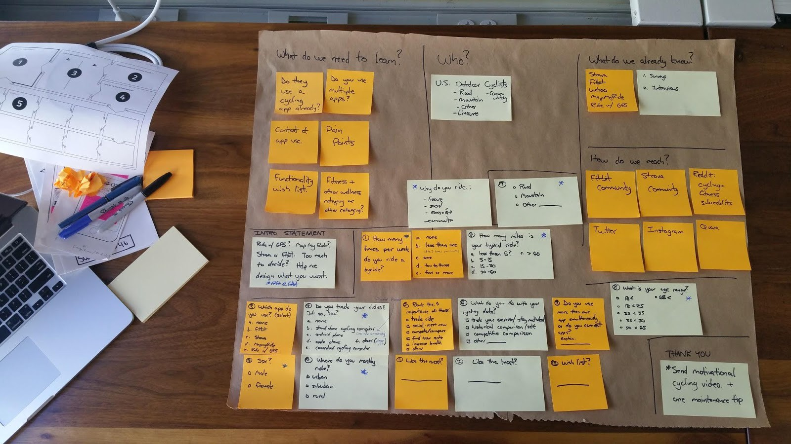

The lean survey canvas is such a great tool to get started. A few takeaways:

- What we’re after: What do we need to learn? From whom? What do we already know? How do we reach them?
- Emphasize with your persona user. What’s their context and how would they approach your app?
- The lean survey canvas is very similar to my past experiences in data analysis and marketing. With a background in wireless telecom sales, construction project management and marketing, and a recent Master’s Degree in Business Administration, I can really put my experience and knowledge to work during the research phase of UX Design.
- I’m finding that a structure that incorporates multiple iterations is incredibly helpful in the design process. At it’s base, simply moving information from one format to another often uncovers insight. On top of that, iterating at each transfer of information and ideas moves creativity and possibility forward. Both last week and now, I have combined ideas when transferring from one stage of the process or medium to another.

## User Research

### The Survey

[Here’s a link to the survey I created.](https://docs.google.com/forms/d/e/1FAIpQLScr0SO-5z2T0jBmbzjKoVWc1Ig6_vdlfkgLt_EjRbA1n9mCiA/viewform?usp=sf_link) (It’s still live as of November 6, 2017!)

### Getting the Word Out

I used Instagram, Twitter, and Reddit to get the word out about my survey. I combined hashtags and mentions of popular apps in the space with a pithy call to action to garner attention: “Help me design the #cycling app you want.” My experience in marketing came in handy.

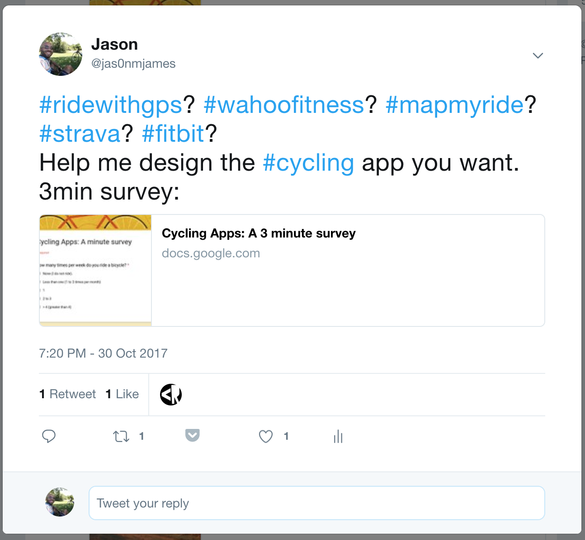

One of the most helpful groups was Reddit’s cycling subreddit (with over 50,000 subscribers). As a member of this group myself (and other groups like this), I did not want to be that annoying I’m-only-here-for-your-money spammer. I provided some personal background to my request.

If you're asking others to take the time to provide their personal thoughts, feelings, and observations, I think it’s important to at least meet them halfway:

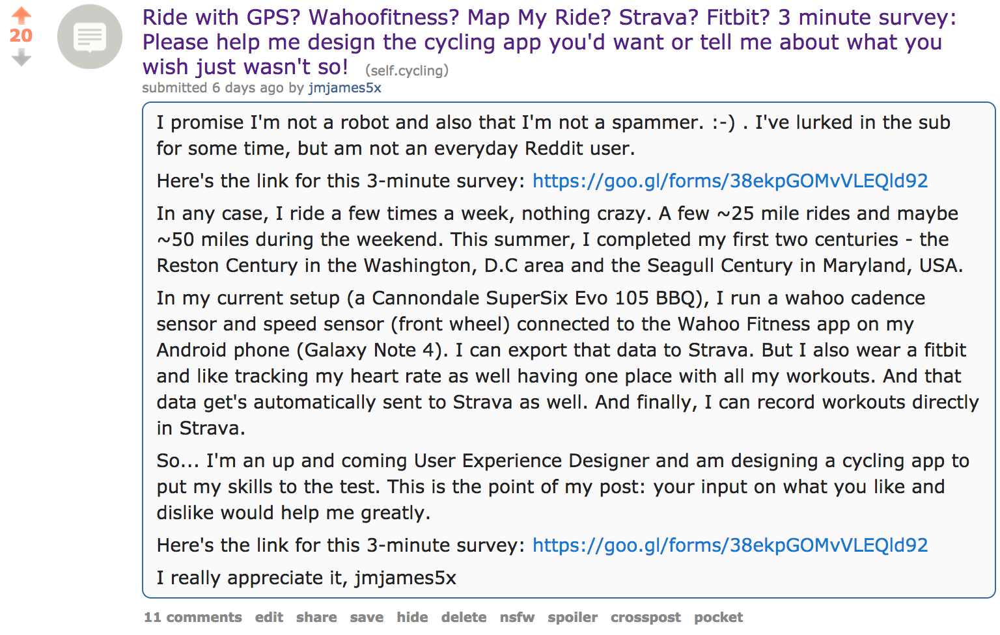

I think it worked and I’m grateful to the online community. I’m actually going to share progress on my cycling app with the group as it progresses so they can see that their time wasn’t wasted.

### Survey Analysis

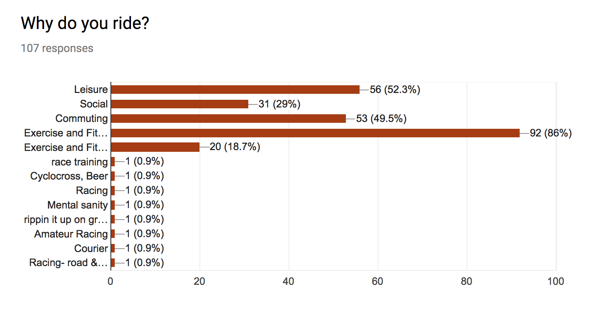

It was clear that there was a market for the app, with 86% of respondents noting that they bicycled on a road (as opposed to mountain biking) for purposes of exercise and fitness.

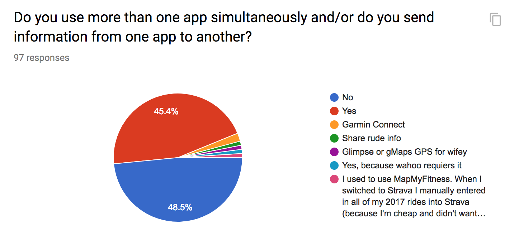

It was also clear that there was a market problem to solve, with 45% of users noting they not only used multiple apps to track data, but used them either simultaneously or sent data from one app to the other.

#### Other Takeaways

Due to time constraints I conducted user interviews and survey responses simultaneously. Looking back, the insight I gained through the user interviews could have helped shape how I wrote the survey. In the future, if time allows I’ll collect interview insight before writing the survey.

### User Interview Analysis

> I don’t like carrying a phone because it’s too bulky or it might rain.

> Mapping that emphasizes ‘safe bicycle routes’ are important to me.

> I still have a stand-alone cycling computer because I had it from before.

The three user statements above exemplify how we can better gain insight into user motivations through one-on-one user interviews.

At a high level I wanted to understand why there might be such a problem in the market with overlapping yet asynchronous apps. Research showed multiple software and hardware platforms spread across a market for fitness-minded road cyclists that was among a broder bicycling market, which was among a still broader ‘fitness’ market. A device that made specifically for a bicycle may be perfect, but not sync with your phone and more yet, not sync with the smartwatch you use to run. So you could buy multiple devices for each activity that might not sync (and come at added expense) or buy a few devices that work better across activities but are not as fitting for any one.

#### Other Interview Takeaways

##### The Five Whys

Often the initial responses an interviewee provide don’t get at the heart of their motivations. By responding ‘why?’ to their verbalized thoughts and feelings — potentially five times — you force them to go deeper and bring out insight at the root.  *Why? Why? Why? Why? Why?*

##### Observe, Engage, Immerse

This is the heart of user interviewing and testing.

### Lean UX Canvas

I used the [Lean UX Canvas](https://medium.com/@jboogie/the-lean-ux-canvas-d4da53263c40) to organize my research:

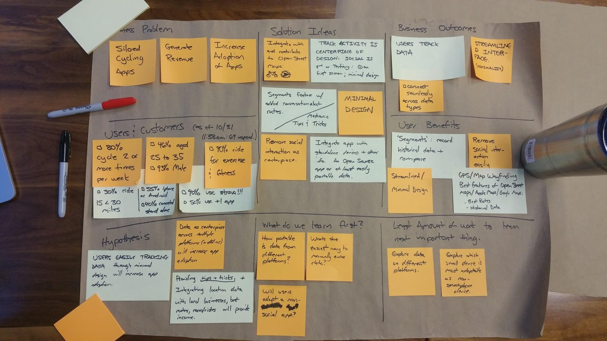

## Competitive Analysis

I compared direct and indirect markets to find features that I could adopt and improve or opportunities to create something new.

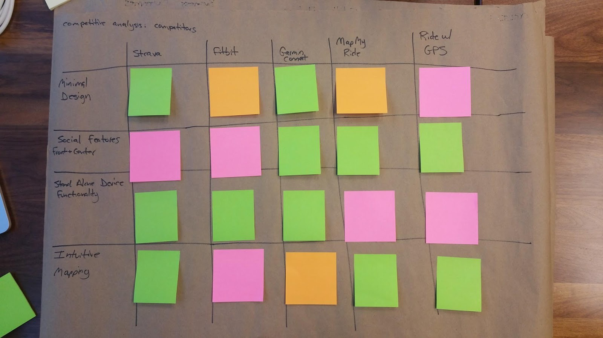

Affinity Mapping of Direct Competitors

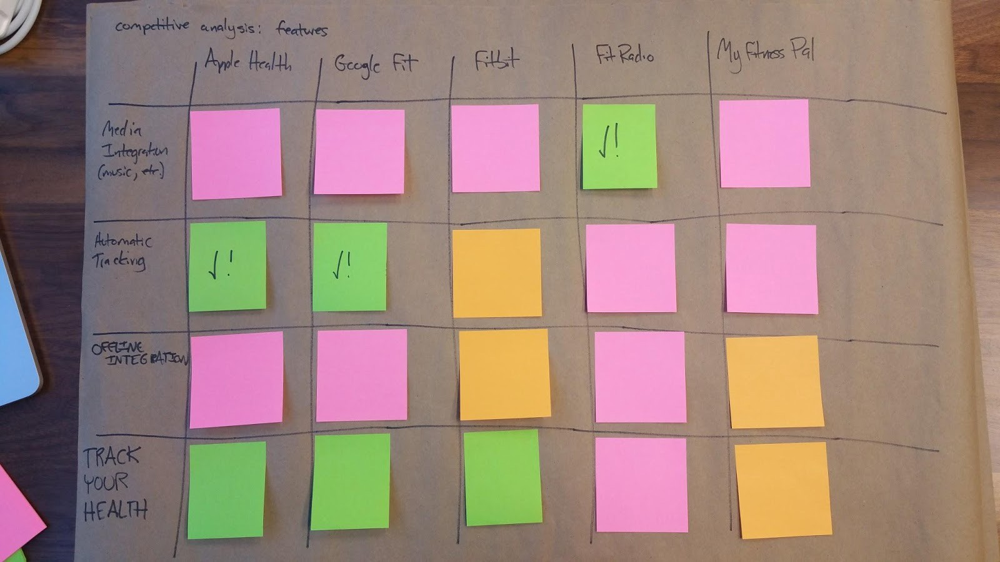

Affinity Mapping of Indirect Competitors

### Market Positioning

I then found a place in the market where I thought I could best position the app: a phone-based, portable application that could connect to offline devices:

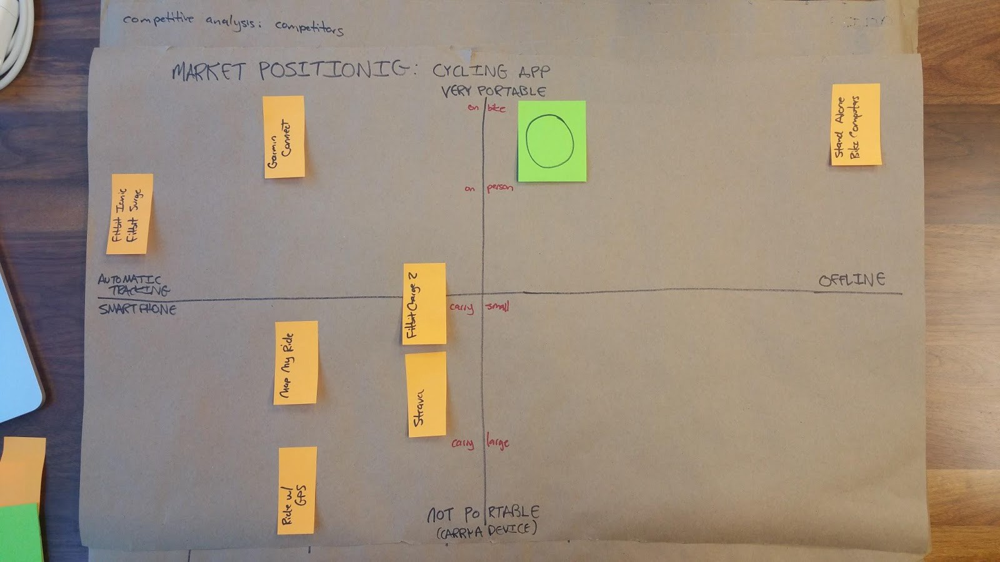

## User Personas: Empathy Mapping

I used an affinity map to organize the user and market research I had gathered so far into groupings that I could shape into personas.

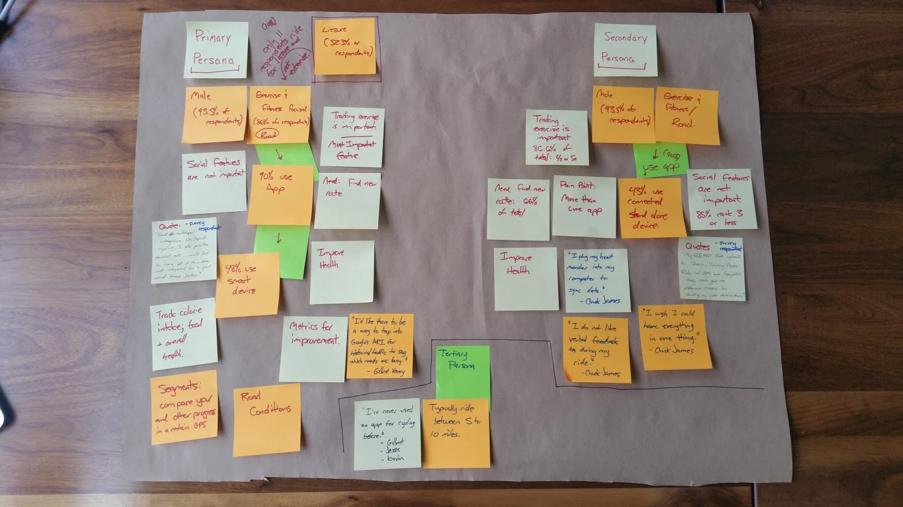

An affinity map organized user and market research.

Personas are idealized users that serve as reference points during ideation and prototyping. Based on the collected research, they help ensure the design is user-centered at every step.

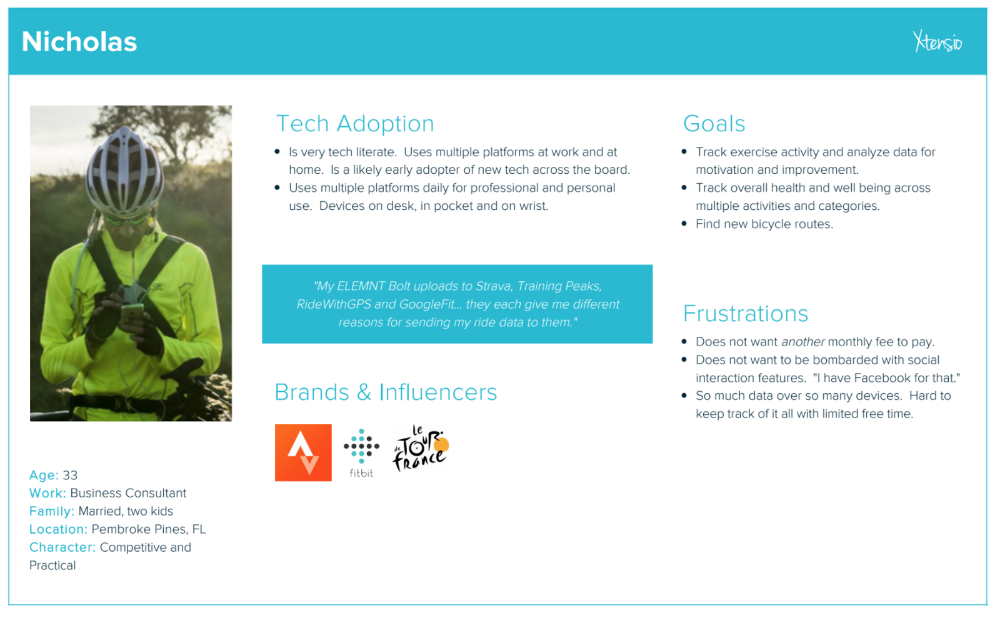

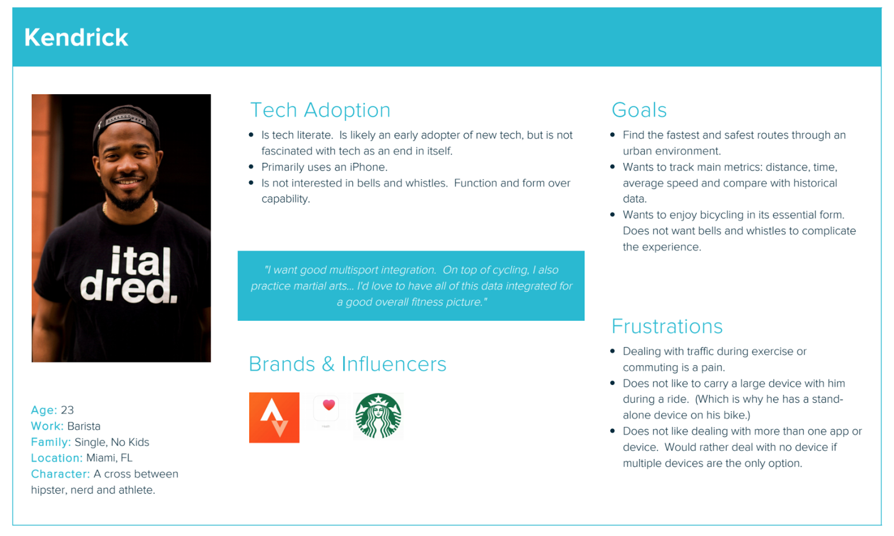

## Problem-Hypothesis Statement

I formed a problem-hypothesis statement that ensured moving forward, the design would meet business needs. This is like a persona, but for marketers!:

**[Simple Cycle ]** was designed to **[streamline the recording and personal analysis of bicycling exercise data].**

We have observed that the product is not providing **[a single point to analyze all data, the most minimal design possible with cycling exercise front and center, nor an intuitive interface to view the best exercise, commuting and safety mapping]** which is **[not generating enough premium subscribers, and thus profitability]** for our business.

How might we improve **[‘Simple Cycle’]** so that our customers are more successful based on **[premium subscriptions]**?

## User Journey Mapping

User journey mapping explores the experience and process of our personas completing a task. It’s a great way of finding opportunities to innovate in the market and center your design around resolving existing user pain points:

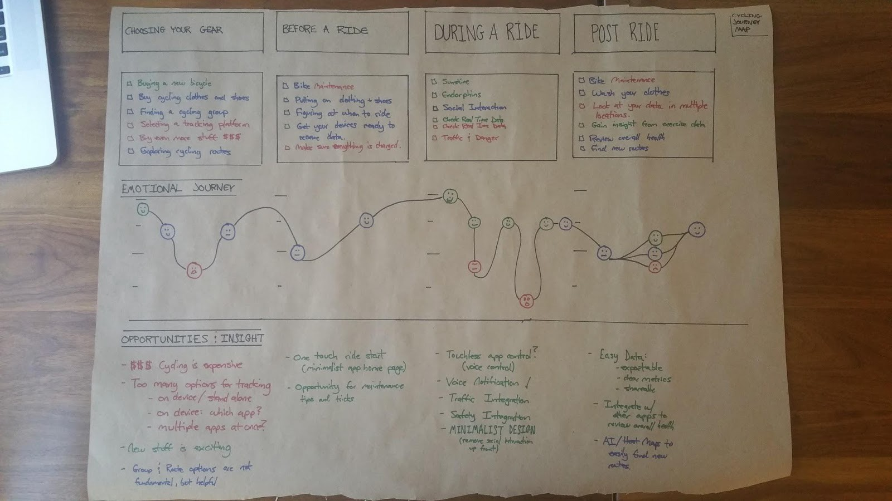

## Ideation

With opportunities in sight, we can begin [ideation](https://www.interaction-design.org/literature/article/what-is-ideation), or to put it simply, we start coming up with ideas. This is less a process of a mad genius pulling great ideas out of thin air, and more of [adapting](https://medium.com/the-mission/5-ways-to-steal-like-an-artist-a505942bf344) already great ideas and designs to a specific context, and perhaps combining something or implementing a feature in a novel way that brings innovation.

I used [Crazy Eights](https://library.gv.com/the-product-design-sprint-diverge-day-2-c7a5df8e7cd0) to quickly sketch out ideas. The goal is to generate as many ideas as quickly as possible around a particular problem, and then refine those ideas by repeating the process. I give myself only five minutes to sketch out 8 ideas, and then repeat it. Limiting yourself to sketching each idea in 40 seconds keeps you from getting weighed down by one idea or sketching a full solution from end-to-end that may not be the answer.

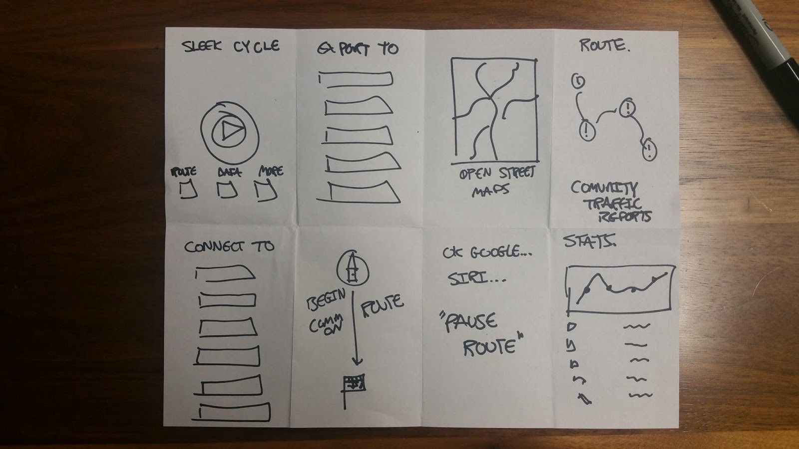

## Feature Prioritization

From my research and crazy eights, I had seven features I could incorporate into the design, however given time constraints and the agile process, I didn’t necessarily want to incorporate all of them at once. What can we [efficiently develop](https://medium.freecodecamp.org/what-the-hell-does-minimum-viable-product-actually-mean-anyway-7d8f6a110f38) at the start that meets all user needs and is fully functioning?

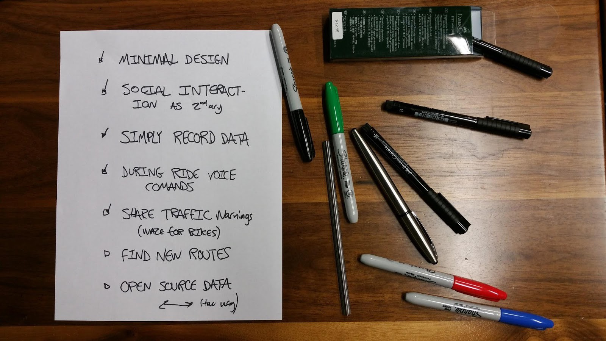

Based on pain points discovered during research, it’s clear a minimal design, in-ride voice commands, and simple recording of data well are key to addressing complaints of too complicated and too distracted apps. Users don’t want the app getting in the way of their ride. Social interaction and crowd-sourced traffic information were of secondary importance to users, but I thought I could implement them in this design process. New route generation and two-way open source data sharing (across apps and platforms) would have to wait for the next design period as they would take sizeable design and development effort.

## Prototyping

Now we’re getting somewhere! I design the selected features across nine screens by hand:

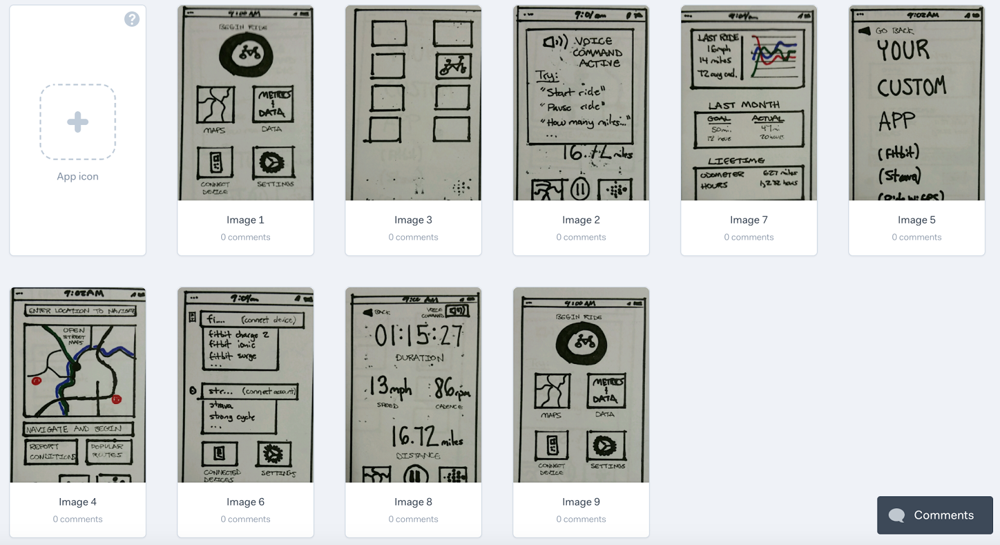

The benefit of doing this first low-fidelity prototype by hand is that I could easily make changes on the fly while not getting too married to a particular idea or design. In-fact, there are two other versions of the data screen that I threw out before the design above.

With the [Marvel App](https://marvelapp.com/) I was able to upload those designs onto my handheld device (Samsung Galaxy Note 4) and create a clickable prototype that I could test with users.

## User Testing

Before the first round of testing, I create a test script that would help ensure the same conditions for each test:

### The Script

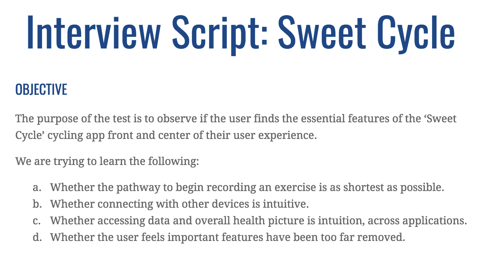

I first remind myself the purpose of the user interviews.

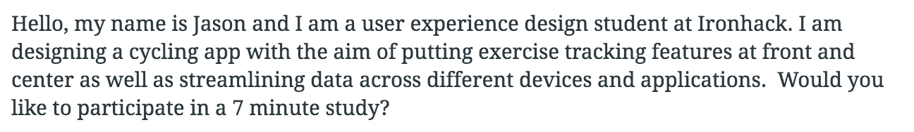

Introducing myself

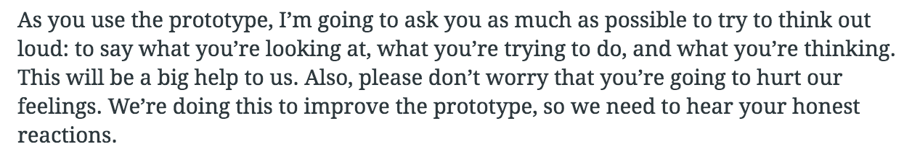

It’s important to explain to the user what the test is and what you’re expecting. I usually include a quick comment that “even though this looks like it was made by a six year old, paper prototypes help us incorporate your feedback quickly.” I think it helps users, especially those older than myself, take me and the test more seriously. Context helps.

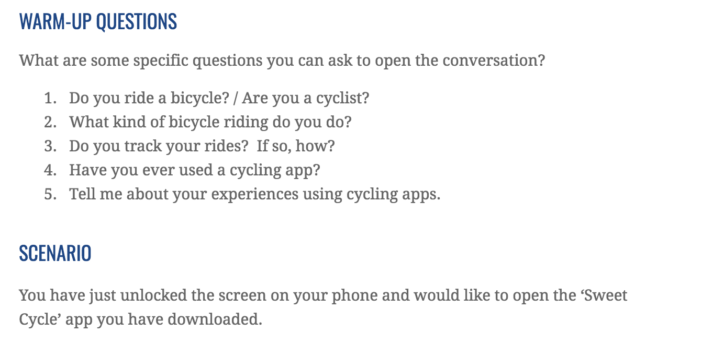

Warm-up questions are great starting points and often provide additional insight I didn’t get during user interviews. They also confirm how much the user fits the target demographic.

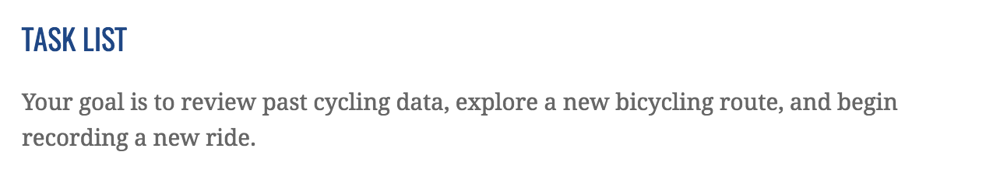

Since this is an early prototype, not all functionality is built in, even if it could be incorporated a paper prototype. We give them a task that directs them along a ‘happy path’ that is built out for their feedback. The ‘happy path’ is essentially the minimum viable product of the paper prototype.

### Testing

[Research shows](https://www.nngroup.com/articles/why-you-only-need-to-test-with-5-users/) that we only need to test with five users to gain valuable usability insight.

With the tester’s permission, I recorded each session on video to better capture both the user’s observations and even their unconscious movements, such as instinctively moving a thumb to an area of the screen when trying to complete a task. Four are shown below:

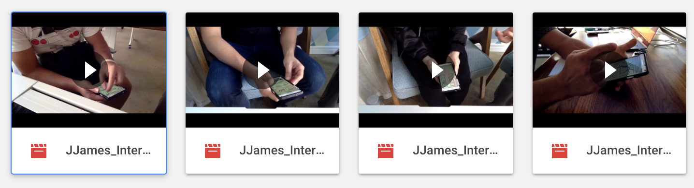

## Task Analysis

Before incorporating the usability feedback from my first round of user testing, I do **task analysis, which is breaking down all of the different actions and steps a user takes to reach their goal**. I could’ve done this before creating the first prototype (like in my School Performance Data project), but doing it now allows me to incorporate the first version’s usability feedback.

*Although we should follow frameworks and carry out testing with objectivity and in a way that would be reproducible, as designers we should adjust how we apply our design tools to the problem at hand.*

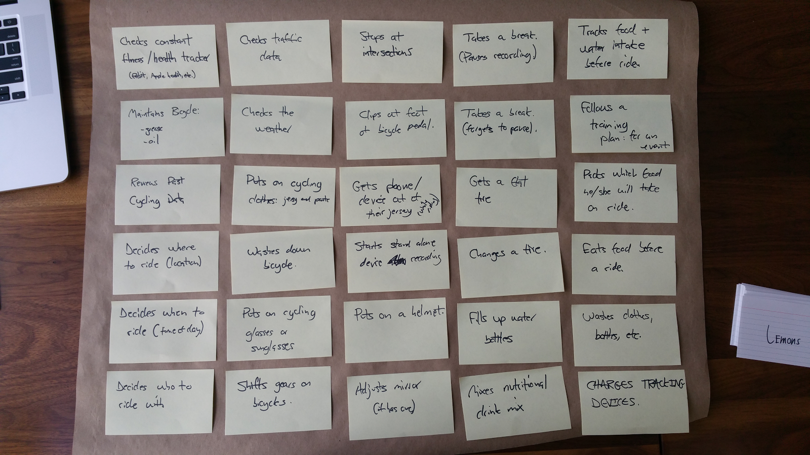

## User Flow Mapping

User flow mapping serves as a base for Information Architecture by organizing tasks (Hey! Task analysis coming in handy!) in the sequential order a user would experience them.

We’re mapping out how the user will navigate across our site from start to reaching their goal. It’s incredibly helpful; I typically find some small intermediate step missing through the process. For example, in the case below, I had originally put a ‘weather’ information screen in the flow before the ‘start riding’ screen, however I realized many users will want to start their ride without necessarily checking the weather. So the user flow let me visually see how I could perhaps place the ‘weather’ screen at two different optional points across the user’s flow.

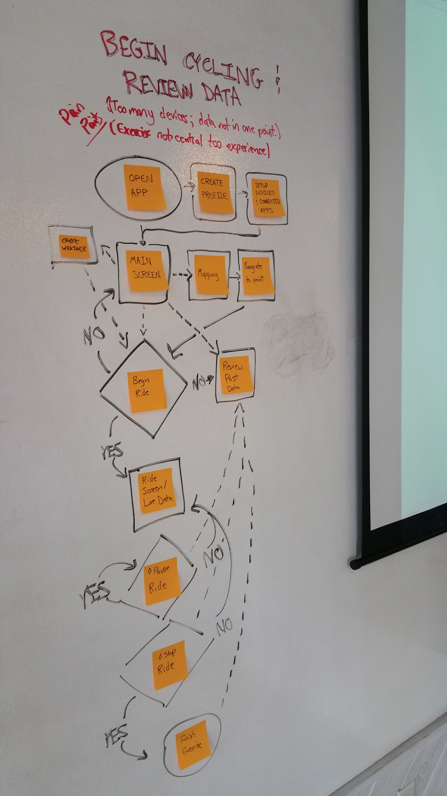

### Site Mapping

Using the screens I made in the first prototype and the user flow generated after task analysis, I created a site map showing all of the screens across the site.

I went back and added color to the site map below based on the style (color and typography) I eventually designed, but initially the site map was just black and white.

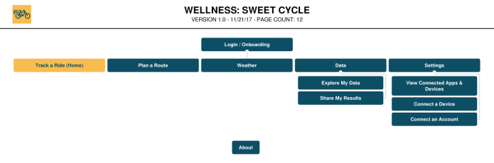

### Hi-Fi User Flow

I still haven’t showed you how I got to my final design yet, but here’s a quick preview. This is what the user flow looked like in high-fidelity when mapped across the final site:

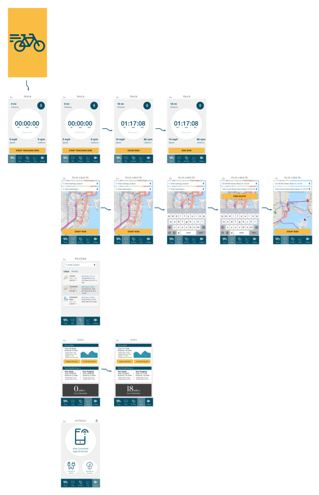

## From Low to High Fidelity

So, how did we get there?

I’ve already discussed making the initial hand-drawn prototypes. I’m going to show you how they developed by focusing on progression of a single screen: the data screen.

**Here it is in the first version you’ve already seen:**

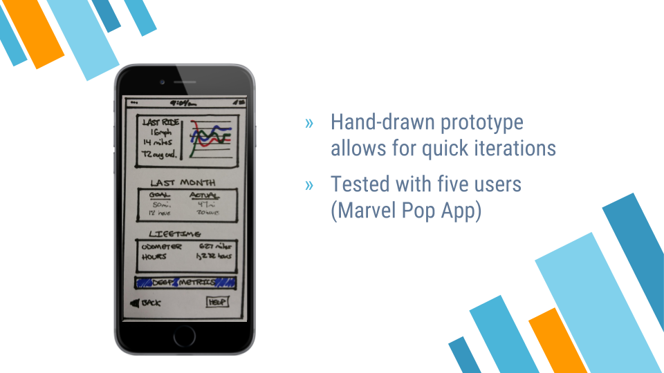

**And here’s the second version after usability testing with five users:**

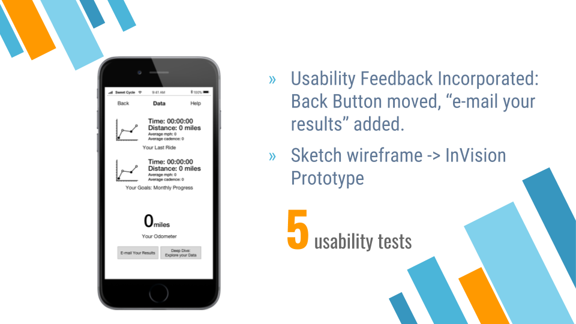

So what changed? The biggest thing you might realize is that we’re no longer designing by hand. 

**I moved to wireframing in [Sketch](https://www.sketchapp.com/) and then turned those wireframes into clickable prototypes that I could test with people in [InVision](https://www.invisionapp.com/).**

What else? You’ll notice, for example, that the back button has moved from the bottom left-hand corner of the screen to the top left-hand corner. It’s so common for websites and applications to have back buttons in the top left-hand corner of a screen, that users were instinctively looking for it there. As designers we need to remember the larger context we’re designing within, even if it’s not optimal.

> It’s the same reason why “save” is often represented with a floppy-disk icon, even though they have been obsolete for almost twenty years. **Design with the user’s context in-mind.**

It’s commonly believed that the QWERTY keyboard was designed to limit typing speed so that ‘back in the day’ people wouldn’t jamb typewriters by typing so fast. Whether you believe this or not ([the economist calls it a myth](http://www.economist.com/node/196071)), the QWERTY keyboard has stuck. If you design a laptop with a Dvorak layout or other alternative, a large percentage of the population will have trouble adapting, even if in the long run it’s a better design. It’s the same reason why “save” is often represented with a floppy-disk icon, even though they have been obsolete for almost twenty years. **Design with the user’s context in-mind.**

**Now we apply branding and style:**

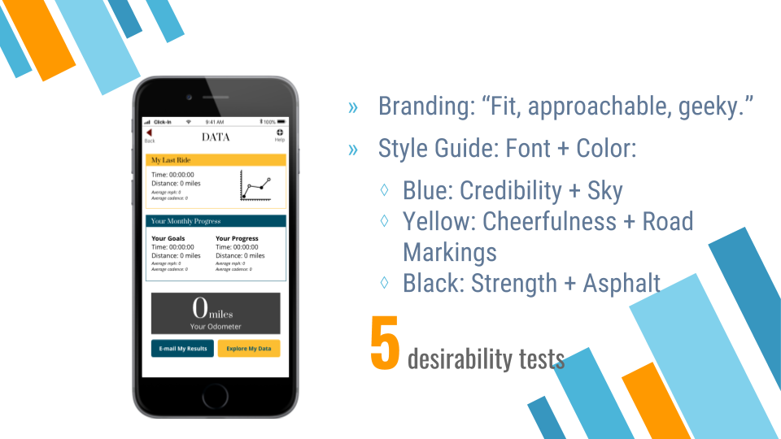

## Applying Style

### Branding

*This is where the marketing enthusiasts out there can get excited!*  Based on my target demographic, I chose branding of “fit, approachable, geeky.” How?

There’s a great design exercise in which you choose a Car, Spokesperson and Brand that carries the essence of the product you’re designing. I chose:

- Subaru Crosstrek
- Friendly, nameless French cyclist
- Livestrong (health, fitness, competition and community)

Which at the end of the day resulted in a brand that was f*it,* a*pproachable and geeky.*

The selected style and colors were designed to evoke those words, as well as intrinsically represent a few selected **product reaction keywords:**

- **Blue:** evokes credibility, one of the selected product reaction keywords based on branding, as well as the blue sky that a cyclist so often experiences. **The idea was to — through color — communicate the brand ideals while connecting with the existing environment of the user.**
- **Yellow:** evokes cheerfulness as well as nicely represents the yellow marking lines on the road.
- **Black:** evokes strength and represents the ever-present (at least most of the time) asphalt a cyclist calls home.

### Copywriting in Scenarios

As I add greater detail to the design, I’ll need to write text (‘copy’) that would actually be displayed in the app. This copy needs to similarly resonate with my target audience. **Calling users “dude” might be okay in a surfer app, but probably not a good idea to use in enterprise software.**

**I wrote example copy for three different scenarios in my app:**

1. Finish a ride — User’s emotion: hard work paid off. Practical humble. Relief: “Ride finished.”
2. Goal setting — “Alright! You’ve added _ more miles this week. You are _ close to your goal.”
3. Unlocking a new route — “Level up! You’ve unlocked a new series of routes to keep you busy. You can tell your friends you’re next level, but don’t rest for long. They’re right behind you…”

### Mood Board

We’ve selected colors, but we need to design exactly what shade those colors will be and how the app will look and feel overall. A mood board combines typography (fonts), color, textures, and images to give us some direction:

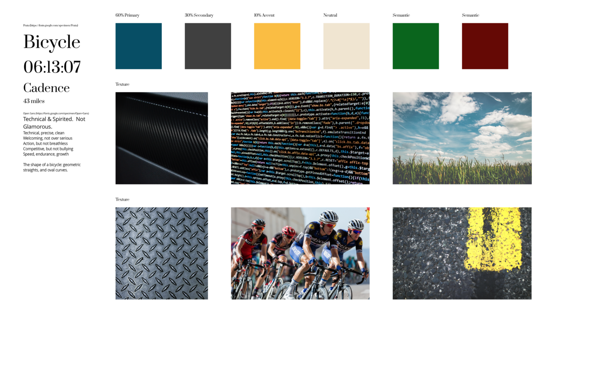

### Style Tile & Desirability Testing

We then create a **style tile** of how those colors, images, and fonts would be implemented on a page and then test the tile with five users in **desirability testing.**

I ask each tester to look at the tile, and then select from a list of product reaction cards the adjectives they feel are most evoked from the design. The hope is for users to pick the same words I had selected above — credibility, cheerfulness, strength.

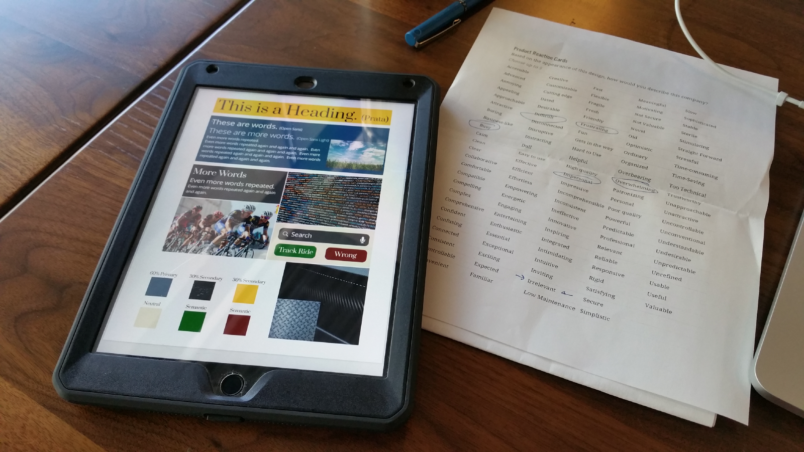

I received so much negative feedback in my first desirability test that I decided to clean up the style tile a bit before testing more users. The initial feedback all had to do with negativity surrounding busyness; there was too much on the page.

**Here’s the style tile, version #2:**

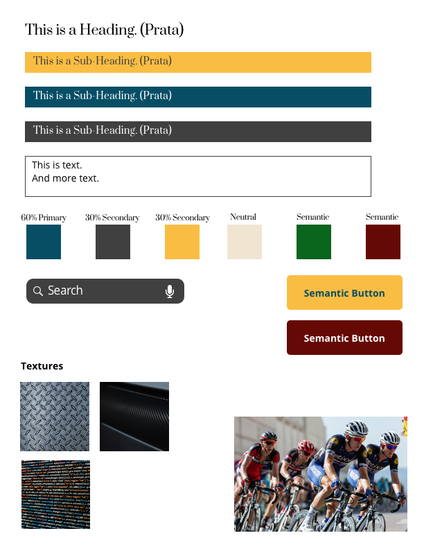

This evoked much closer emotion to what I was looking for, however had I more time designing the project, I would’ve spent additional days refining the style further based on better, but not yet excellent feedback.

### Designing Empty State and 404 Pages for Mobile

Before designing the high fidelity screens, I try out the style on empty state and [404](https://en.wikipedia.org/wiki/HTTP_404) screens:

#### Styled Empty State

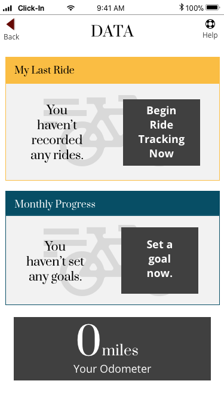

#### Styled 404 Screen

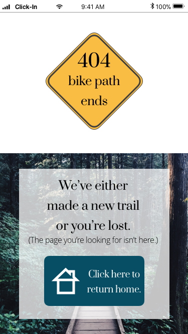

### Designing for the Responsive Web

I also needed to consider how the app would function across the responsive web. I was designing mobile-first and up until this point had only been designing for mobile. [The idea is that if your design works well on mobile, it will definitely work well on tablet and desktop.](https://www.uxpin.com/studio/blog/a-hands-on-guide-to-mobile-first-design/) Mobile first and responsive design really deserve a case study all by themselves, but I’ll save that for later.

**Now I wanted to see how this design would look across mobile, tablet, and desktop to ensure the mobile design was heading in the right direction:**

#### On Mobile

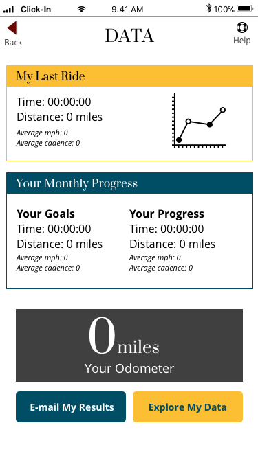

#### On Tablet

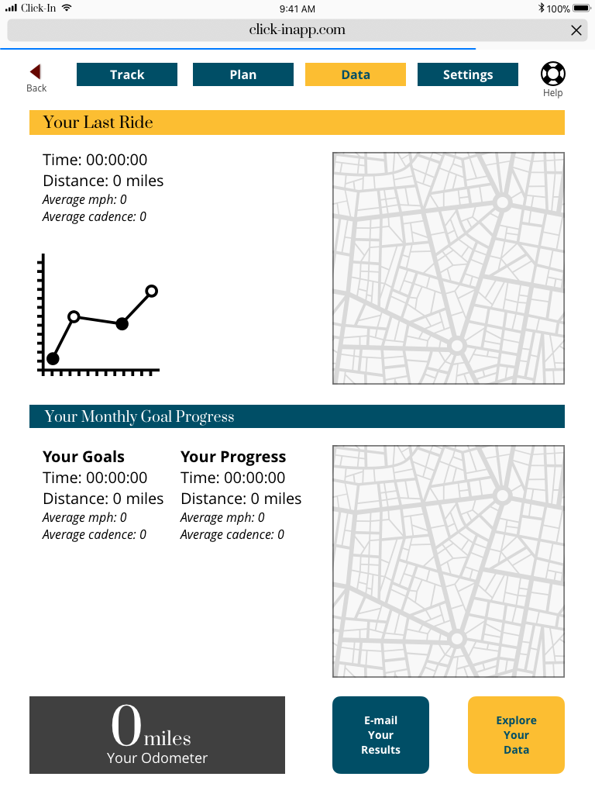

#### On Desktop

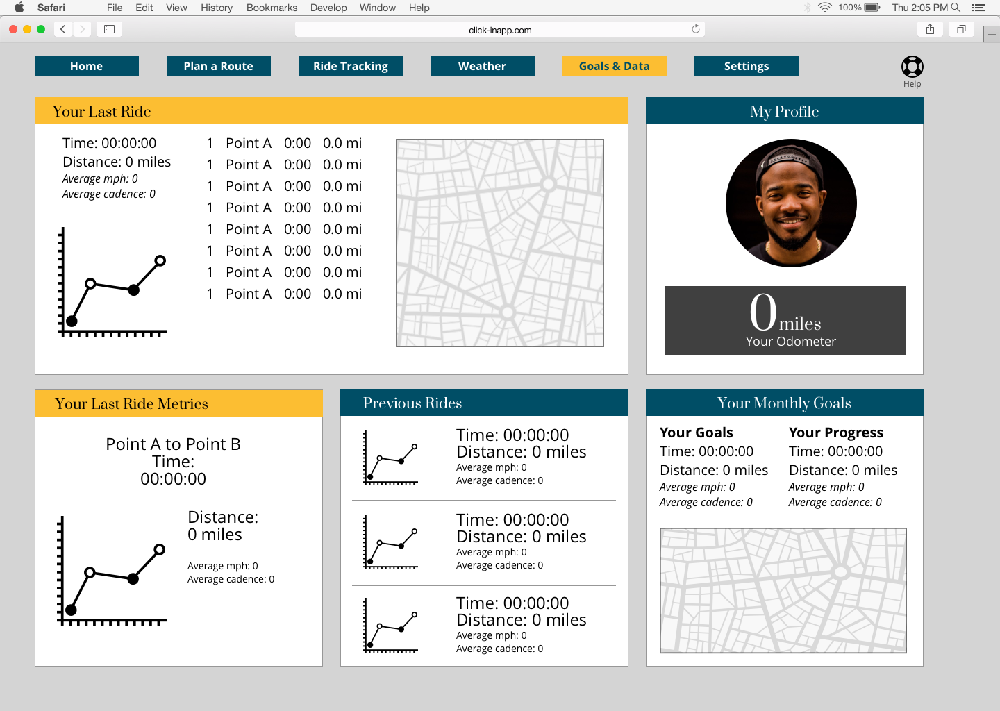

These designs are not yet at highest fidelity; they’re missing the pixel perfect details that make great designs pop. But we’re getting there.

### A Style Guide for High Fidelity Design

Before finally designing the highest fidelity screens, I create a style guide, which codifies the style tile into a guide a can actively use during UI (user interface) design. The idea is that I should be able to copy elements from this guide and paste them into my design.

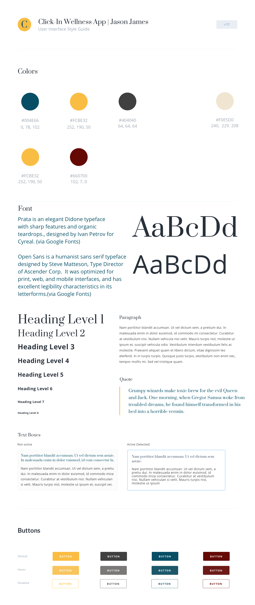

### Arriving at High Fidelity

And finally, here we are!:

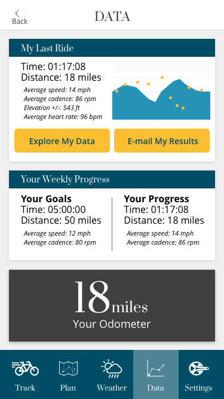

I ensured that gestalt principles such as spacing and grouping were incorporated to the highest pixel-perfect quality.

After consulting with colleagues, I also removed the “help” button I had had for so long.

> They say that User Interface (UI) design is like a joke: if you have to explain it, it’s not that good.

If your designs are not intuitive enough so that they require a “help” section, you should take a second look at the design.

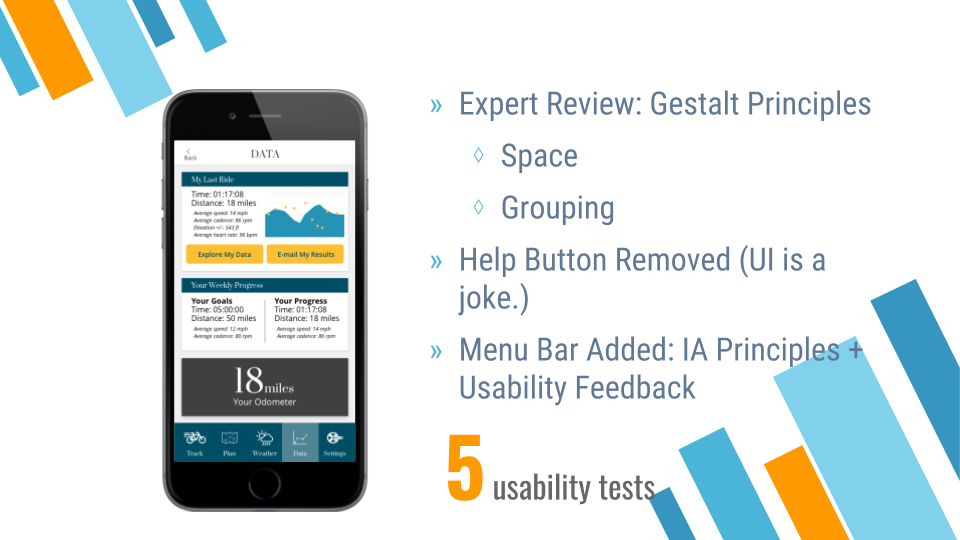

I then uploaded the design into InVision and tested the prototype with five users to gain some final feedback for future improvement: [https://www.youtube.com/watch?v=cm6zMngRKEg](https://www.youtube.com/watch?v=cm6zMngRKEg)

## Designing & Coding a Landing Page

As I arrived at the end of this project, I had an opportunity to design a landing page that users would arrive to before downloading the app. I designed the page using a layout that was proven to produce clicks and applied the same branding and style as the app:

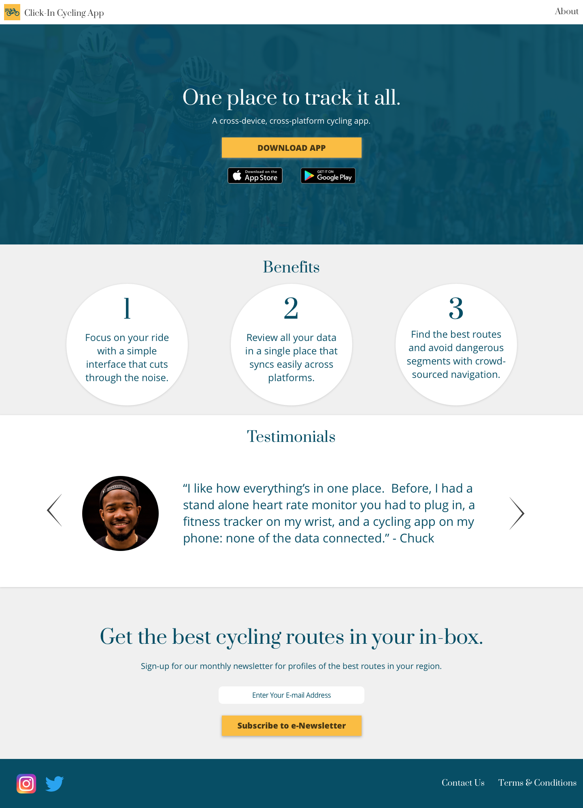

**And guess what, I developed it in HTML and CSS too!:**

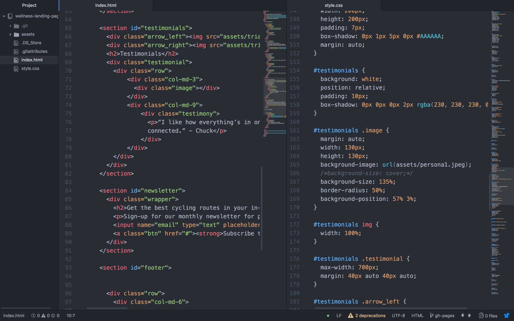

I developed the landing page I designed in HTML and CSS.  The page is live on Github (see [https://jas0nmjames.github.io/wellness-landing-page/](https://jas0nmjames.github.io/wellness-landing-page/)) and if you’re interested I’m happy to discuss in more detail the coding process. (It deserves a case study by itself!)

Why did I code it? **As designers, we need to be conscious that what we design works for the developers** who make our high-fidelity mockup prototypes come to life. I’m designing for the web. I better know how to speak its language and communicate at no less than a basic level.

Developing will continue to come in handy and I’m excited to keep my coding skills relatively fresh as I grow as a UX Designer, Product Designer, and perhaps Product Manager.

## Improvements and Next Steps

### Incorporate Gamification

I had the privilege of hearing [Lindsay Grace](https://twitter.com/Mindtoggle) lecture on [gamification](https://techcrunch.com/2012/11/17/everything-youll-ever-need-to-know-about-gamification/) at a local Miami [IxDA](https://ixda.org/) meetup in November.

The idea is that you can incorporate ‘play’ into even non-game contexts that help keep users motivated and engaged.

I want to mention here there’s great potential for addiction and harm in not just gamification but design at large and I’m very glad there’s folks like Lindsay Grace showing how to do it right.

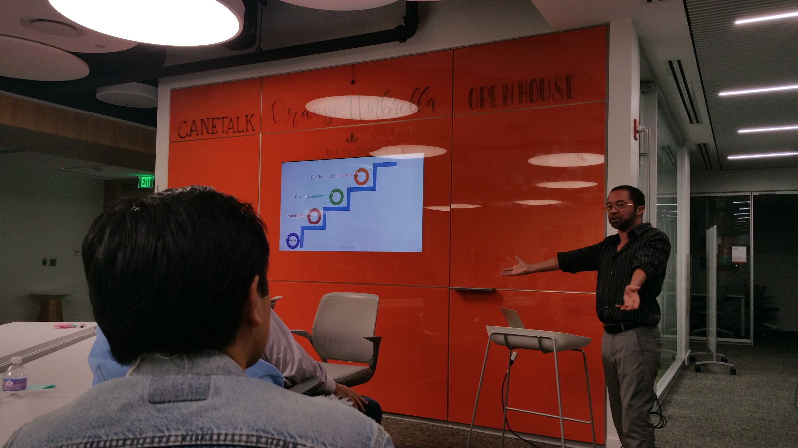

I would like to incorporate two gamifying features into the cycling app:

- Unlockable routes — When you progress to a certain level of fitness, new bike routes are unveiled to keep you interested and increase the level of fitness difficulty
- Track ride and overall progress (via usability testing of navigation) — I want to add a progress bar that will show the cyclist how far they’ve gone and how much remains to be completed when they are following a route.

### Next Steps

Moving forward, I’d also like to:

- Further refine the UI Design by focusing on style, particularly color.
- Analyse how data functionality I designed in the app would work on the backend by exploring and developing in the [Strava API](https://developers.strava.com/).
- Add micro interactions in [Flinto](https://www.flinto.com/).

### A Final Takeaway

‘Srum’, ‘Agile’, and ‘Lean’ are not scary words nor are they complicated at least in basic understanding. Iterate (make better) and prioritize. Then iterate and prioritize. Then do it again. It’s essentially “the path is made by walking” in web and software development form. Instead of starting with a completely fleshed out plan at the beginning, you break the work down into little chunks of minimum viable products that can stand alone. The proof is in whether your product includes the features you need to meet user goals and if it’s functional. A check for both means success.

Also, for your further reference:

- [MOSCOW Prioritization](https://www.interaction-design.org/literature/article/making-your-ux-life-easier-with-the-moscow) — figure out what to work on first
- [S.M.A.R.T. Goals](https://en.wikipedia.org/wiki/SMART_criteria) and [KPIs](https://en.wikipedia.org/wiki/Performance_indicator) — figure out how to define and measure success
- [Pomodoro](https://lifehacker.com/productivity-101-a-primer-to-the-pomodoro-technique-1598992730)! — a great time management technique
- When giving feedback, be actionable, specific and kind. (Thanks [Maite](http://maitedalila.com/)! — My amazing UX/UI Instructor)
- Inspiration is for amateurs. (Chuck Close) — [Good ideas don’t drop from the sky.](https://lifehacker.com/5972825/inspiration-is-for-amateurs--the-rest-of-us-just-show-up-and-get-to-work) They come out of doing a lot of work and [at first your work probably won’t be as great as you’d like it to be.](https://vimeo.com/85040589) And that’s okay.

## Thank You

Thanks for your time. You can find me at [jasonmjam.es](https://jasonmjam.es/) or on [LinkedIn](https://www.linkedin.com/in/jas0nmjames/).
