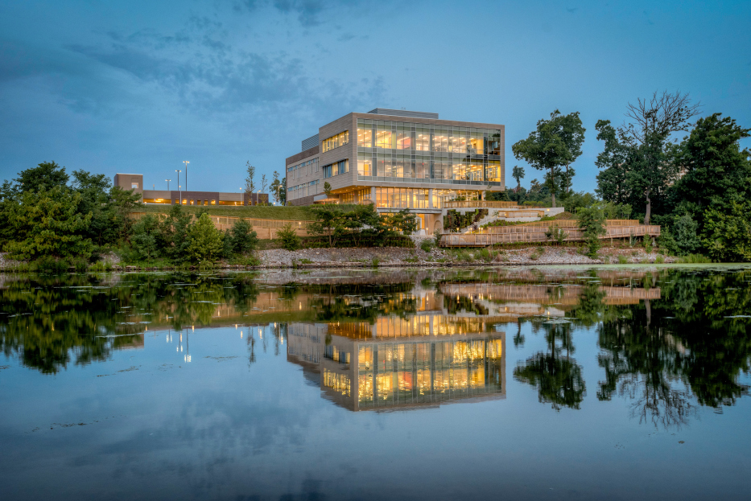
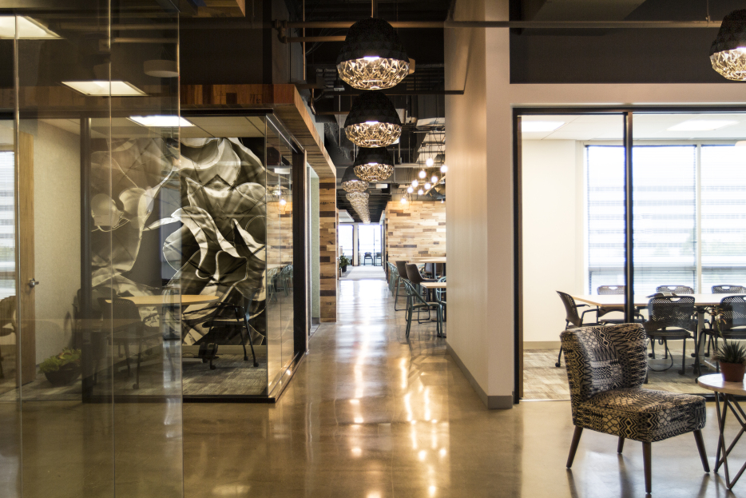
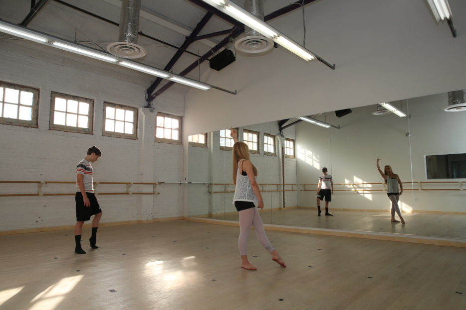
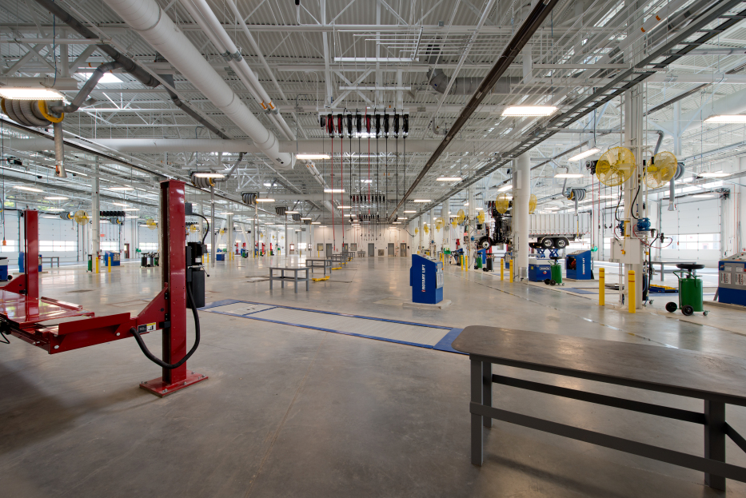
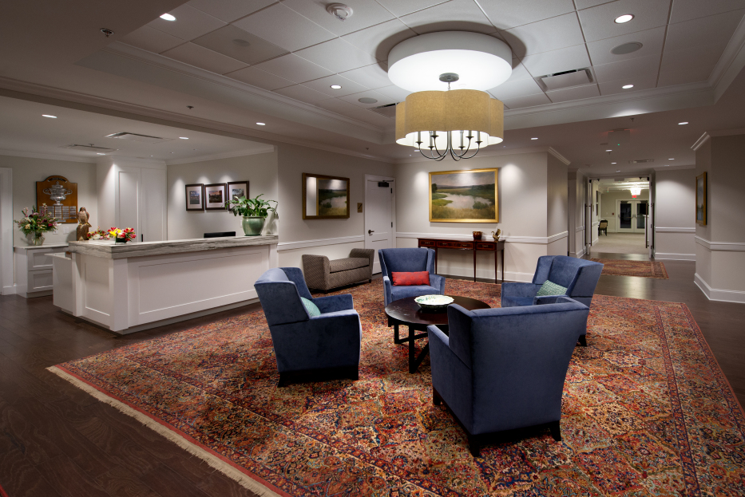

*Originally published via Wordpress on December 29, 2017.*
*Last edit February 2020. (Formatting Only)*

I was on the construction team (and when noted also the marketing team) as Assistant Project Manager or Project Manager for the projects below. I worked closely with the design team (architects and engineers), clients, and trade subcontractors to make these projects happen on-time, within budget, and built to the highest standards. *The awards prove it.*

Many thanks to my colleagues at [E.E. Reed](https://www.eereedmidatlantic.com/) for making me part of the family. What we accomplished is plain to see.

## GMU Potomac Science Center | Woodbridge, VA | $25,000,000

- Winner of 2017 NAIOP Northern Virginia Award of Excellence.
- I put together the award submission package as business development manager and helped build the project as Assistant Project and Project Manager.

## AOL Steve Case Center Renovation | Sterling, VA | $5,000,000

- Winner of 2016 NAIOP Northern Virginia Award of Excellence
- Winner of 2017 IIDA Pinnacle Award.

## Metropolitan Fine Arts Schools | Lorton and Alexandria, VA | $1,000,000

## Newington DVS Maintenance Facility | Newington, VA | $30,000,000

- Winner of 2015 Fairfax County Award of Excellence

## Mount Vernon Country Club Renovation | Alexandria, VA | $2,000,000

## Thanks

Cover photo (first image at top of page) by [Igor Ovsyannykov](https://unsplash.com/photos/I610NmXZwqo?utm_source=unsplash&utm_medium=referral&utm_content=creditCopyText) on [Unsplash](https://unsplash.com/?utm_source=unsplash&utm_medium=referral&utm_content=creditCopyText).
