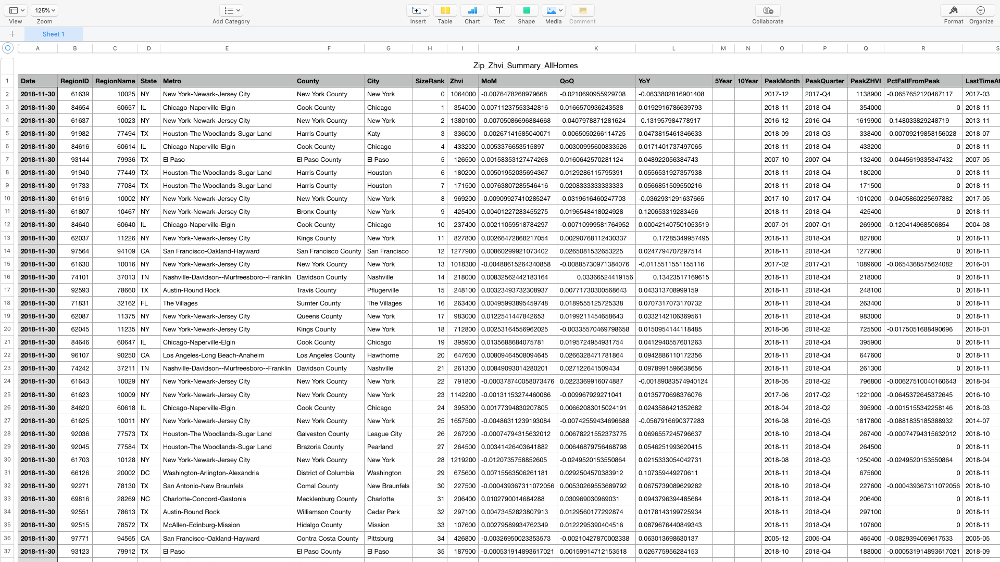
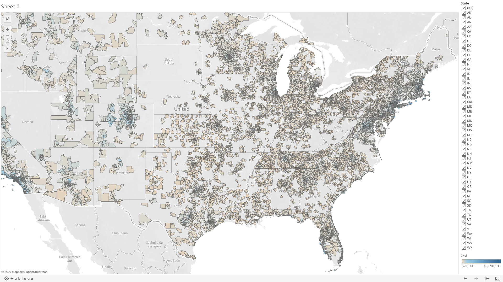
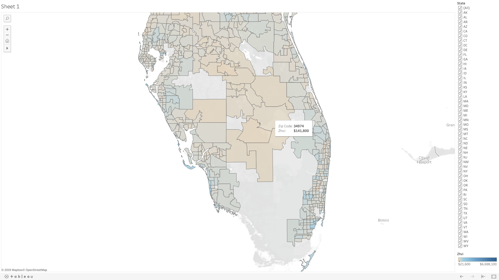

# Data Visualization & Analysis

*Originally published via Wordpress on March 14, 2019.*
*Last edit March 2019.*

**Processes:** Data Analysis
**Tools:** Excel, Tableau
**Technologies:** N/A

Data Visualization can be an incredibly useful tool to discover insights in user testing data and in business analysis in general. When done right, the data is plain for all to see and can help avoid lengthy, subjective arguments.

To exemplify this, in December 2018 I took mortgage data made [publicly available by Zillow](https://www.zillow.com/research/data/) (thanks!) and with the help of [Tableau](https://public.tableau.com/profile/jason.james#!/),

**turned this:**

**into this:**

The data in the spreadsheet were [Zillow Home Value Indices](https://www.zillow.com/info/whats-the-zillow-home-value-index/) by zip code. Using Tableau, I plotted the values across a map as color and then manually adjusted the 'temperature' or hues of the colors based on the median value across the entire data set.

Initially the visualization was not as informative because a few outliers made much of the country look very similar. (It all looked like one color). But, once dialed in, one can easily make correlations like higher home value indices closer to urban centers. It's so much more apparent than in the spreadsheet!

The reason I used mortgage data in this mini project is because home prices are something most people have some sort of experience with and a frame of reference for and because the Zillow Data set is so large it seems hard to grasp.

Perhaps later on this year (2019) I'll post a more in-depth article on how manipulate data in Tableau or even some common Data Analysis tools in Microsoft Excel. You can even get started with machine learning in Excel and, for example, try out [Naive Bayes](https://en.wikipedia.org/wiki/Naive_Bayes_classifier) on your data!

Here's a link to the [live Tableau workbook](https://public.tableau.com/profile/jason.james#!/vizhome/USZillowHomeValueIndexbyCounty/Sheet1).

March 2019
