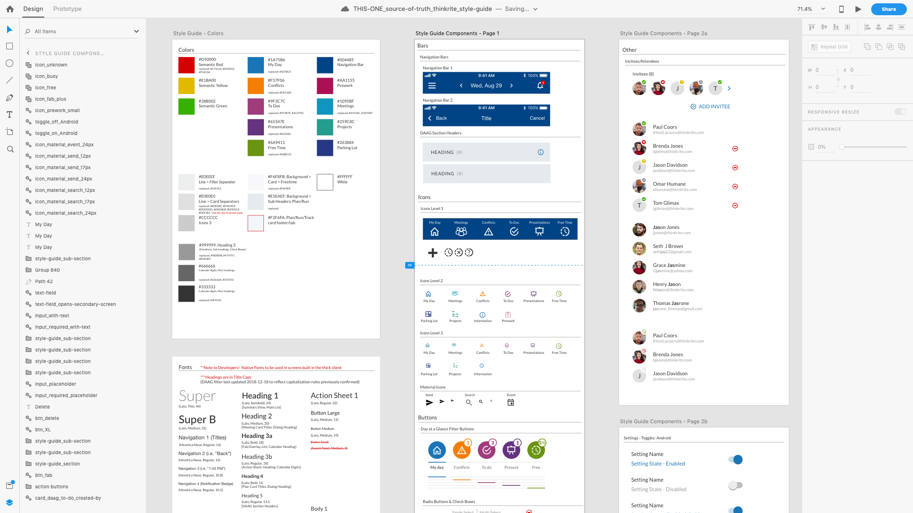
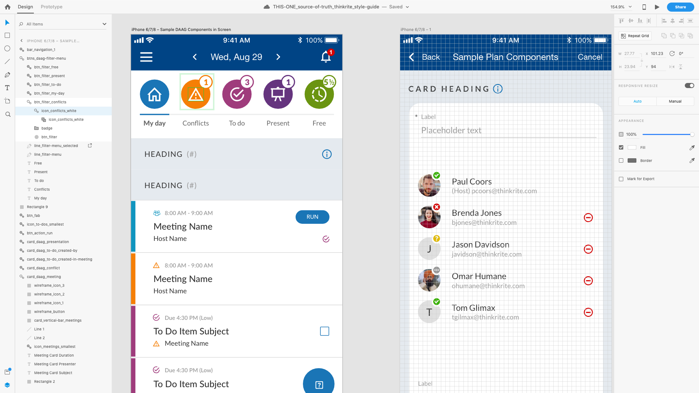

*Originally published via Wordpress on March 14, 2019.*
*Last edit March 2019.*

- **Processes:** Style Guides, Design Systems
- **Tools:** Adobe XD
- **Technologies:** iOS, Android

I previously wrote about building a Design System in Sketch for my own [BloomBox project](http://jasonmjam.es/portfolio/bloombox-design-sprint/).

As a member of a four person product team, on my own I built out a design system in Adobe XD for use across the team.

Although I can't take credit for the overall visual design (a UI designer was on the team), **I personally rebuilt every component within XD and created nested symbols that could accept design changes across multiple components, screens and files.**

Here's an example of one of the symbols:

Notice in the layer panel on the left, the 'conflicts' icon is nested within the conflicts filter button, which is further nested within a menu.

As the product is not yet fully released and I'm under NDA, I'm hesitant to show more, but you can see how this could improve a designer's workflow: make a change in one place and that change will be reflected everywhere.

March 2019
