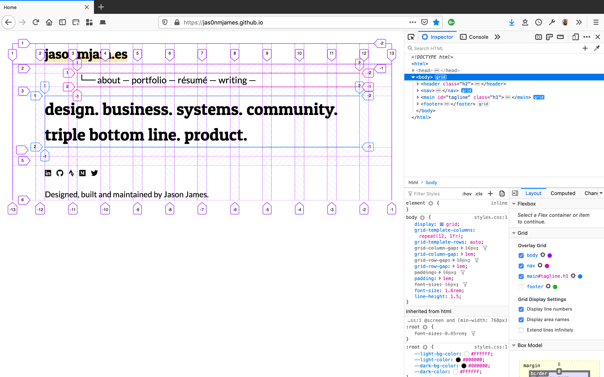

## Introduction

I previously created my portfolio site with Wordpress.  That site is still accessible at [jasonmjam.wordpress.com](jasonmjam.wordpress.com).

There are a number of benefits in creating a site with a powerful CMS like Wordpress, but I wanted to build a new site from scratch for a number of reasons:

- Write in [markdown](https://github.com/adam-p/markdown-here/wiki/Markdown-Cheatsheet) as widely as possible.  This includes when taking personal notes, writing documentation for work, and in this case, creating site content.  For many years I've had notes in all sorts of formats across different devices.  It's been inefficient and a pain to unify.  I'd like to follow [indieweb](https://indieweb.org/) principles.  With markdown, I own my content and formatting is (largely) universal.
- Create clean markdown copies of my past writing for archival purposes.  
- Refresh my Sketch (and larger UI) chops.  I have been working a lot in Figma at work.  In another side project concurrent to this one, I'm learning Framer X.  
- Learn CSS Grids.  See inspiration from [Ahmad Nassri](https://ahmadnassri.com/) / [Olivia Ng](https://twitter.com/meowlivia_/status/1116784686640979968)
- Experiment with static site generators.
- Learn the [JAMstack](https://jamstack.org/) a bit better after seeing my dev colleagues working in React and Gatsby.

To view milestone accomplishments of the project and resources I found helpful during its creation, view the repository's [README.md](README.MD).

## The Repository

Feel free to view, clone or even fork the repository: [https://github.com/jas0nmjames/jas0nmjames.github.io](https://github.com/jas0nmjames/jas0nmjames.github.io)

I'd be happy to answer any questions!

P.S. You can find the design and other files I created before and during development that are not intended to be deployed in the repository's [working folder](working-folder).

## Technologies / Tools

- [Jekyll](https://jekyllrb.com/) static site generator written in [Ruby](https://www.ruby-lang.org/en/)
- [Liquid](https://shopify.github.io/liquid/) templating language
- [HTML](https://developer.mozilla.org/en-US/docs/Web/HTML)
- [CSS](https://developer.mozilla.org/en-US/docs/Web/CSS)
- [iTerm 2](https://iterm2.com/) terminal emulator for MacOS
- [Sketch](https://www.sketch.com/) - I used Sketch to explore and layout the design before development
- [Visual Studio Code](https://code.visualstudio.com/) - text editor
- [Atom](https://atom.io/) - open source text editor
- [Typora](https://typora.io/) - macOS markdown editor which helped in copying and reformatting existing markdown content from Wordpress
- Git & [Github Desktop](https://desktop.github.com/) - I prefer interacting with Git and Github repositories using Github Desktop.  Why not make it easier if you can!
- [CircleCI](https://circleci.com/)

## Translating Markdown

My intial task was to translate the existing pages I had written on my Wordpress site or on Medium into Markdown.  This provided a chance to revisit my case studies and improve formatting when necessary.  

There are some markdown converters available, but I wanted to ensure my posts were clean.  It took quite a bit of time.  [Typora](https://typora.io/) helped a bit by copying and pasting assets into a separate directory for each post.

## Design

I first created a rough layout in markdown of the content I wanted to build the site with.  (See [content-home.md](working-folder/content-home.md))

After viewing many contemporary designs, considering I wanted my site to be **accessible**, and considering the possibilities of markdown and Jekyll, I decided on a simple, text-focused mostly black-and-white design with ample white space.

Perhaps I'll revist this post in the future and comment more on the design decisions in more detail.

I than began to lay out the site in Sketch across multiple device sizes for good responsive design:

### A short note on Typography

I had previously developed personal branding which formed a starting point for some of the design.

However, after exploring several fonts I settled on [Patua One](https://fonts.google.com/specimen/Patua+One), instead of the previously used [Prata](https://fonts.google.com/specimen/Prata), to communicate the feeling I am trying to convey in this minimalist design.  They both pair nicely with Roboto, which I am using as body text throughout.

In the future I will write about this in greater detail.

## Translating the Design to HTML & CSS

Before building the site with Jekyll and Liquid templating, I created local html & css to experiment with the design, especially as related to [CSS Grids](https://css-tricks.com/snippets/css/complete-guide-grid/) and [Responsiveness](https://www.smashingmagazine.com/2011/01/guidelines-for-responsive-web-design/).

### CSS Grids

It was my first time working in detail with CSS Grids and I wanted to build everything from scratch so I could really understand their implementation.

Here, I'm using Firefox's inspector to view the developed grids:

The grid system helps organize the content and even reorganize the content depending on screen type, size and orientation.

### Tweaking HTML & CSS

You can find the code before I translated everything over to Jekyll in the working folder:

- [Original HTML](working-folder/index.html)
- [Original CSS](working-folder/style.css)

I also created templates for different page types:

- [Portfolio Page](working-folder/template-article-list.html)
- [Post Page](working-folder/template-article-writing.html)
- [List Page](working-folder/template-article-list.html)
- [General Page](working-folder/template-page.html)

View the [commit history](https://github.com/jas0nmjames/jas0nmjames.github.io/commits/master) to see all the tweaks made over the course of exploring and understanding the design.

## Development

### Learning Jekyll

I spent some type in the Jekyll tutorial to learn the basics of Ruby and Liquid along with Jekyll's typical configuration.

With Jekyll installed locally, I could build and serve my new site with a few key commands in the termial:

- `bundle exec jekyll build`
- `bundle exec jekyll serve`

Jekyll is easy to deploy with Github, so I created a new repository, configured it for integration with Jekyll, and was on my way.

### Building Out the Site

I faced a few hurdles in getting my site working properly, mainly around getting Jekyll 'configurations' working and targeting different parts of the site with CSS to ensure a clean, responsive design.  Styles evolved as needed and will continue to.

View the [commit history](https://github.com/jas0nmjames/jas0nmjames.github.io/commits/master) to see how development progressed over time.

If you have any questions about why I'm using html classes and ids the way I am, or how I'm using liquid templating, or other choices I made, please let me know!  

## In Closing

I'm so glad I built this site from scratch.  I've increased my understanding of HTML & CSS several fold and have more context in which to engage developers in general.

I've run into several blockers which have meant it's taken much longer for me to complete this site, but I'm glad for it.

As I continue to refine and build out the site, I'll update this post accordingly.

February 2020