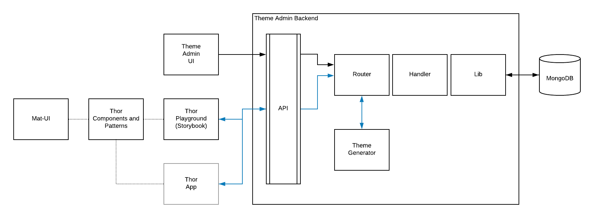

*This page was last updated on February 11, 2020.*

- **Processes:** Mobile First Design, Design Systems, Design Theme API,
- **Tools:** Figma, Sketch, Github, Github Projects, JIRA, Confluence, Bitbucket, Bamboo, CircleCI, Slack, Swagger, Chrome/Firefox Developer Tools, React Developer Tools,
- **Technologies:** React, Material Design, Material-UI, JSON, CSS, APIs, MongoDB

## Introduction

Cross.Team worked closely with a large financial institution to redefine the user experience of worldwide traders and their managers.  

This newly redesigned presentation layer foundation was delivered as a full design system and allowed the IT team to design, develop and quickly deploy a world-class user experience for internal end-users and stakeholders.

Because of the NDA signed with our client, I am referring the project as "Project Benji" throughout this case study.

### My Role

Lead product designer.

Worked closely with front-end and back-end developers to implement a new presentation layer:

- Presentation layer in React for 20+ year high profile global trading platform for fortune 500 financial institution
- User research including c-suite stakeholders
- Requirements gathering: balancing user needs and usability heuristics with legacy architecture and technical constraints
- Provided internal project management of design & dev and facilitated communcation across our and client's team
- Manage material.io design system in Figma with nested styles and components
- Quality Assurance & Testing

### My Activities

On any given day I might:

- Interview and record a stakeholder
- Modify a material-ui component in Figma to create a new component for the project
- clone a repository to my local machine and `yarn install` then `yarn start` in the command line to run the project locally.
- debug a site using chrome or firefox development tools in the browser; might include inspecting ui issues or adding breakpoints in the network tab to figure out where an api is failing
- create markdown documentation and submit a pull request
- create and manage github issues in a project board
- draw wireframes for a new page layout
- populate a design with json real data in Sketch
- provide project updates to the client during client meetings or via weekly summarized correspondence
- drive internal standup meetings
- encourage communication across design and development to architect solutions given project constraints

## Case Study

I joined this project after the bulk of the user research had been accomplished and the overall design direction had been established.

At a high level, I:

- translated this overall design into specific layouts as needed
- helped to define business logic during data integration
- helped to faciliate communication across development teams, stakeholders and the client's project management
- performed user research and design for new UX problems and requirements as they were presented
- work with developers to debug the application

I'd like to present to you below a snapshot of what we were able to accomplish with the product and a high level overview of the tasks I performed in that aim.

## Visual Design

Before joining the project, my colleagues had established the overall visual direction.

I helped refine that visual design in light of the detail we uncovered as we integrated the back-end APIs into the UI:

### Updating a 20 Year Old .NET UI to a Modern, Mobile First, Material Design React Friendly UI

The major design research performed by my colleagues Marcelo and Kat before I joined established the overall visual direction of the product:

#### The .NET UI

#### The New Proposed Modern UI

Kanban views were proposed to help reduce user's cognitive overload by prioritizing the information needed at by a user at any given time.

List views were still available, but in a modern UI:

#### A Mobile First Approach

A mobile-first design approach helped clarify design decisions and ensured a scalable architecture for the future.

Each column is designed to fit on a mobile screen:

Additional views were designed as drawers that could stand-alone as a single screen on mobile:

### Design System Architecture

One of the beautiful things about this project is that we built it on top of a tokenized and componetized design system and provided a single source of truth for the UI across the application that could be quickly modified with variables:

For example, we could change the primary color used throughout the application by adjusting a single color variable in our token database.  This became very useful when the client requested three different versions of the application - we created a theme for each version which was distinguished by a different primary color.

The design system architecture of the product deserves a much lengthier discussion that I should touch on in the future.

### Translating Design to Development

After we as a team decided on the overall product's architecutre, much of my work in the beginning of the project was helping the development team understand the existing product as we were translating it into the new design and integrating the data.

Here's an example of some of the field mapping work I did to help break things down for my colleagues:

My colleague Rudy Architected the new designs with respect to the newly built components, overall product architecture, and existing APIs:

We worked together to translate this architecture to each layout:

### Project Management

To help keep us on track, I created a kanban board in Github Projects and worked with the team to set priorities and resolved doubts regularly:

Github Projects was just robust enough for our project without being _too_ heavy and its automated integration with our Github repositories made life much easier.  

### Documentation

I spent a considerable amount of time helping to craft the project's documentation as we planned to hand off the project to the client's development team and wanted to leave them in good hands.  Here's a few examples of that effort:

We used storybook as a sandbox for our components.  Here I discuss how to access it:

Here's an example of documenting one of the custom components we designed and developed:

Beginning to discuss the design token database:

Documenting examples of the design system theme .json:

Writing about the architecture of the project:

### Truly Cross Functional: A Designer Does QA

Further along in the project, I worked with my colleague Sebastian to help find and fix bugs in the code.  When necessary I compiled the application locally:

It's great as a designer to be able to dig into the code and help test the application:

I leaned on my colleague Sebastian heavily to help him test as efficiently as possible, but I knowlege about React and front-end in general greatly increased over this QA process.  

My empathy for the potential complexities in development grew leaps and bounds.

### User Research for the Future

In addition to all of the above, I also worked to research newly requested features or workflows not yet designed.

Here's an example of some of my user interview notes:

And some of the whiteboarding we did to solve problems uncovered in the user research:

## Conclusion

I know I did more showing than telling in this case study.  My goal was to show you the myriad roles I played on this project - each topic above could be expanded into its own, longer case study.

One of the larger hurdles we faced in the project was integrating data from the existing APIs into the new design.  We had been expecting a .json with key value pairs that would be ready for integration, but found a much more complicated situation waiting for us.

To integrate the data, my colleague Rudy ended up having to create an SDK from scratch - basically an intermediary between the APIs and the front-end components that helped normalize the data.  We ended up using the SDK for data validation as well - as requested by our client - even though we suggested in the long run that data validation be conducted on the back end.

For our team, the ultimate success of this project was the atmosphere we created to work across two development teams, stakeholders across the globe, and between design and development.  

You can't succeed in such a complicated project without a foundation of camraderie and teamwork.
