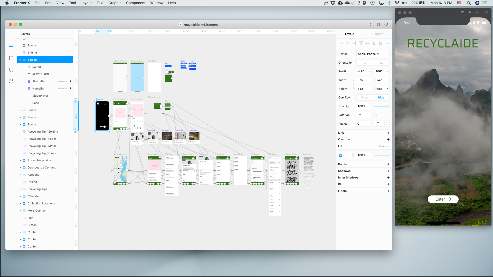

*Last edit February 11, 2020.*

- **Processes:** Mobile First Design, Chat Protyping, Sketching
- **Tools:** FramerX, Botsociety, Mind Node, Visual Studio Code, Sketch, Pen & Paper
- **Technologies:** *Coming Soon*

## Introduction

Recyclaide is an in-the-works social enterprise with a vision to:

> create a network that partners with communities to generate shared wealth, alleviate poverty, and leave behind a more sustainable world for future generations

More specifically:

>Recyclaide is a recycling logistics company focused on reducing the environmental impact of urbanization and its carbon footprint while providing a source of supplemental income to its partners.  Recyclaide is aware that mitigating the negative effects of development requires long-term solutions that begin at the community level.  Operating in this context, our business model focuses on encouraging the collection of recyclable materials with a pilot program in Guayaquil, Ecuador.  The company’s objectives are to improve recovery of recyclable material, create an effective mechanism to ensure collection, and develop capacity among partners in the formal and informal recycling sector.

### My Role

I joined the team pro bono in late 2019 to help bring the ideas they had for an app to life.  

Because the design effort was/is done in my free time and the company is seeking funding, the overal design goal was to **quickly create an interactive prototype** that could be submitted as part of the grant process.

I also provided input on their already-developed business plan and overall approach as appropriate or when asked.

### Framer X

This project was an opportunity for me to learn to prototype with [Framer X](https://www.framer.com/), a great tool built on top of React.  

After paper, I did some initial designing in [Sketch](https://www.sketch.com/), but found designing and prototyping in Framer much quicker for the purposes of this project and prototyping more powerful overall.

The fact I could import components that interacted directly with real APIs, like the Mapbox component, was a huge plus.  I had real working maps in the prototype!

## Project Goals

The existing team of three had been working on the business idea for a while before reaching out to me.  They knew they wanted an app and had created an early prototype in PowerPoint:

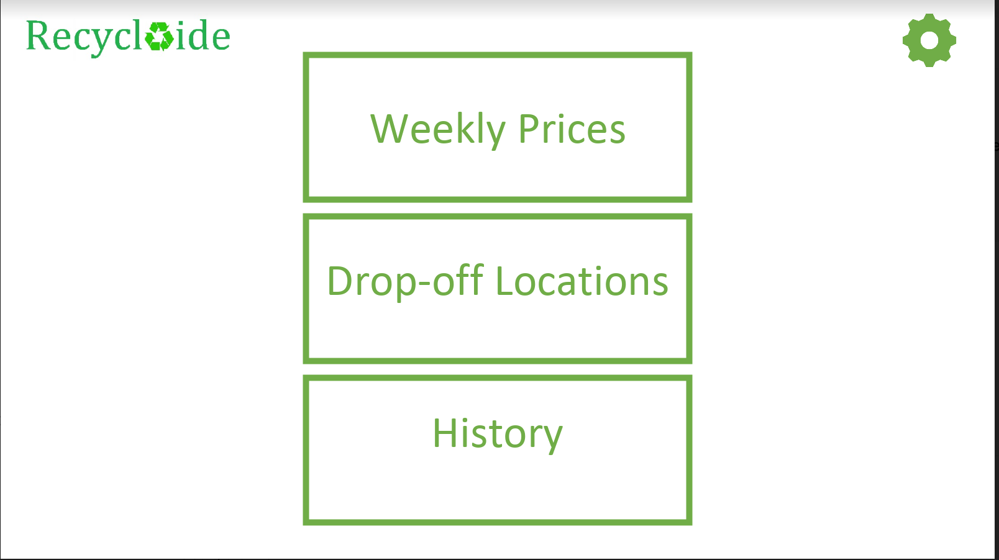

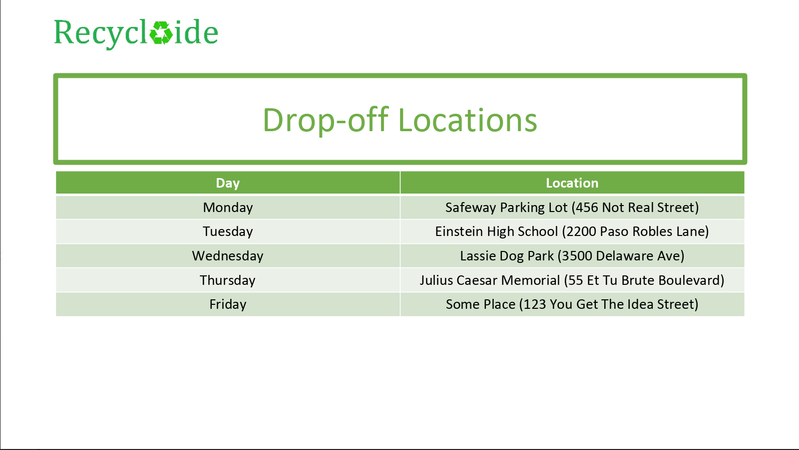

There were a few additional screens noting other functionality.

From the existing prototype and intitial conversations, the main priorities were:

- Two user types: administrative and partner (persons collecting and then dropping off recyclable materials to Recyclaide to receive payment)
- View material prices
- View drop-off locations
- View partner's recycling history
- Receive payments through the application
- **A working prototype that could be demonstrated to potential project funders**

## Research

The project team had local contacts in Ecuador, but were not ready to engage in in-depth user research and testing for the application.  

The team was not familiar with a robust UX/UI design process, so I met with them to explain the process at a high level and provided some suggestions on a path forward given their constraints.

### Requirements Gathering

Their ideas were at a high level and evolving, so I asked them to answer several questions in writing to help provide design direction and nuance:

<!-- I'd like to include markdown codeblocks, but I'm having difficulty rendering them with Jekyll.  Will need to revisit.  - JJ 2020-02-11 -->

> What I'm seeking now is to try to better understand and define the problem(s) your users are facing.
>
> But before that, I need to ask a few questions to you, the stakeholders:
>
>Goals
>
>- What are the major goals for this product?  (This should be basically synonymous with your business plan.)
>- What does success look like for this product?
>- What are the goals for this phase of the project?  i.e. "Develop a prototype to present in grant applications".  What specifically do you need to be >able to demonstrate?
>- What does success look like for this phase of the project?
>- What is the timeline for this phase of the project?
>- What are the constraints for this phase of the project as you know them?
>
>Target Market
>
>- Who is the product made for?  (May be multiple/different groups.)
>- Why?
>- Provide demographics for the 'typical user' of each target market: age, gender, occupation, location, socio-economic status, income, and any >additional information we should consider.
>
>Features
>
>- List and describe in detail the features of the product as of today.  "As a user, I will be able to..."  You can separate these into different >feature sets if you have different types of users.
>
>Requirements
>
>- What are the minimum requirements (you know of now) for the product?  I know it's a bit of a vague question right now.  I'm purposefully leaving this >open ended.
>
>Users - Best practices would mean asking real users these questions.  But we'll start with your ideas of their needs first.
>
>- What are the typical user(s)' needs?  "I need to..."
>- Goals? "I would like to..."
>- Pain Points?  "But I can't or it's difficult because..."
>
>Much more to ask, but this is enough to get started.  My goal is to tease out "WHY?" in the attached mockup.  Why was it built this way?  What >considerations were made?  etc.
>
>Following answers to the above, the next step would be to either start sketching out ideas on paper or to ask clarifying questions.

The team responded with a feature list:

<!-- I'd like to include markdown codeblocks, but I'm having difficulty rendering them with Jekyll.  Will need to revisit.  - JJ 2020-02-11 -->

>Desirable features
>
>Partner Facing:
>
>1. Calendar that highlights drop off location
>2. Notifications to give update on various things such prices, locations etc
>3. Ability to review past performance (how much money has been made)
>4. Tutorials – including ways to identify different products
>5. Mobile Money section – either fully integrated or linked in
>6. Simple log in feature for security reasons
>7. Integration of simple GPS app such as Google Maps that can guide partners to drop off location (obviously this feature is a bit more data-intensive >but if its possible to integrate I believe its a good one to have).
>
>Cashier Facing:
>
>1. Log in feature
>2. Inputting what the weight, type of material that partner brings and having the total payout automatically calculated. (Ideally weighing machine >would be digital and so can connect directly to the tablet/phone of cashier)
>3. Having a control feature that fights potential fraud. (ie. Maximum payout limit, maximum weight per person etc)
>4. Two step verification – once regular cashier inputs info, manager has to still approve before payout.
>5. Ability to register partners/access partner information
>
>Company Facing:
>
>1. Report Pulling
>2. Sending out Notifications
>
>Cashier/transaction process
>
>1. When the partner brings up their materials to the site, they will firstly register through their phone number and will be given the chance to >provide other contact information (email, etc.).
>2. Once registered they will then have the materials briefly inspected, weighed by the cashier and based on the weight and materials brought, this >information will be sent to the supervisor on site and they will have to approve it and a payout is made.
>3. The materials are then loaded into the truck and the next partner moves to cashier.

### Identifying Technical Constraints

The most potentially complex part of the application was integration of mobile payments.

The high level business need was for users to be able to be 'paid through the application'.  What that specifically meant was poorly defined.

I researched:

- what payment platforms were available in Central America and globally
- the business aspects of the platforms including features and cost
- and documentation, if available, on how to integrate the platform into another application.

I spent time digging into the team-suggested Mobile Money, [WorldRemit for Business](https://www.worldremit.com/en/business)' mobile application, which had great features like WhatsApp integration and in-person cash pick-up centers throughout the world.

After more digging, I came across [Transferwise](https://transferwise.com/us/) which had many, but not all, of Mobile Money's features.  

One of the most promising findings about Transferwise was its seemingly much more accessible and [well documented API](https://api-docs.transferwise.com/#connected-apps-guide), which would be crucial in making development smoother.

## Finding an MVP

Given the relatively short timeline they had expressed, the limited resources, and the potential complexity of designing not-yet-defined mobile payments feature(s) in the applicaiton, I suggested we had three options for moving forward:

1. Design the app with all of the 'nice to have' features without regard to technical complexity or options.  i.e. Payments could be designed as a feature in the app without reference to any platform.  Users could check their balance, add a payment account, view transaction status, etc. all within the app.
2. Design the app with most, if not all, 'nice to have' features, but considering using a platform like WorldRemit.  Even if not actually developing to connect to said platform, design the prototype to account for it.
3. Design the app with minimum payment features.  Users could view their Recyclaide transaction history, but not check their actual account balances, for example.  It'd be similar to a typical online store user experience.  Users could edit their contact information which would direct Recyclaide where to send money, but no actual banking/payment information would be held in the app.

In the end, we moved forward with option #3 for the immediate future.  This simplified the design effort needed at the current stage of the project.

## Information Architecture

Before sketching, I thought it'd be helpful to organize all of the features into a simple mind map:

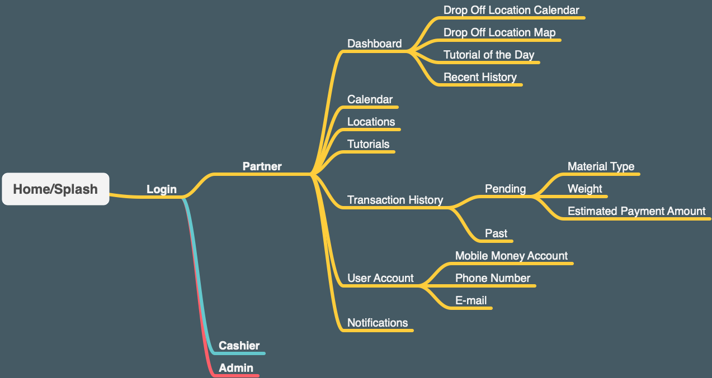

I chose detailing only one user persona "partner" and suggested for this phase in the project, an App with functionality only for the "partner" user would be sufficient for the purposes of fundraising.

## Sketching / Wireframing

With the mind map as a guide, I began with some simple sketching.  The goal here was speed at a very high level; just enough to be efficient as possible before starting visual design and prototyping:

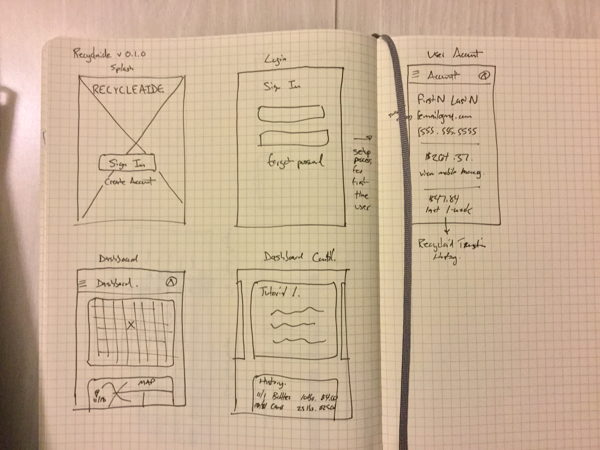

From the get go I used [Material Design](https://material.io/) principles as a framework when sketching because of its universality, mobile first approach, and past experience.

## Designing a Chat Bot

### Suggesting the Feature

After some initial sketches and conversation with the team about their target market, I suggested a SMS chat bot feature that could communicate information without the the app.

- It would provide access to low-income users who may not have a smart phone.
- It would provide access to users who may have poor internet connectivity.

Even if users couldn't check their account balance or interact with a user interface (UI) via SMS, they could accomplish almost all of the goals the team had described.

### Information Architecture Revisited

Starting with designing the chat bot's interactions also helped me revise the information architecture in greater detail before moving on to Visual Design.

[Botsociety](https://botsociety.io/) is a fantastic conversational interface design tool I discovered a few years ago.  You basically prototype both sides of a conversation - the user's input and the chat bot's available responses.  You can even build the chat bot's API within Botsociety!  

Here's the flowchart of the final chat bot conversation design:

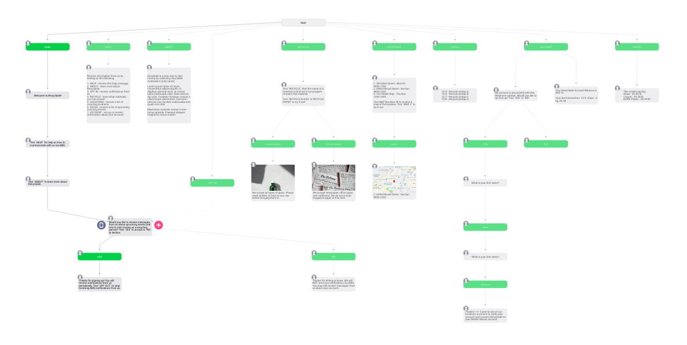

You can see how this would help think through information architecture, as every conversation is essentially a user story.

### The Resulting Chat Bot

Once completed, you can interact with the chat bot prototype.  Here's the result:

<!-- I'm including html img tags here to control the height for this image. -->


In addition to the GIF above, you can [download the MOV here](2020-02-11-recyclaide/recyclaide-chat-bot.mov).

<!--

### Interact with the Chat Bot

You can interact with the prototype directly here:

<script type='text/javascript' src='https://app.botsociety.io/embc/5a66306842c52d0c00bc6935'></script><a class='botsocref' style='position:fixed;left:-30000px;' href='https://botsociety.io'>botsociety</a><a class='botsoc' rel='nofollow' href=https://app.botsociety.io/emb/5dd1fed0809d6b31b7cec2bf?p=4e53b13c1af3ab8d69330fba2368cb7797f47da4' target='medium'></a>

-->

Ultimately these chat interactions and the entire application would need to be translated to Spanish for the target market.  We'd also need to make sure the translations and chat interactions were clear and simple enough for local speakers.

## Visual Design

I took Material Design principles into visual design even if not using Material Components.

### Starting in Sketch

I had intended to use Sketch for visual design and found a great, freely available :innocent:, design system & component library: 

The [Eva Design System](https://eva.design/)

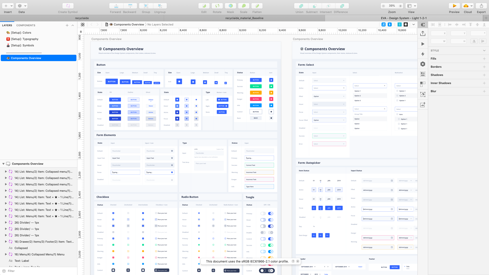

Design with Eva helped get up and running very quickly in Sketch:

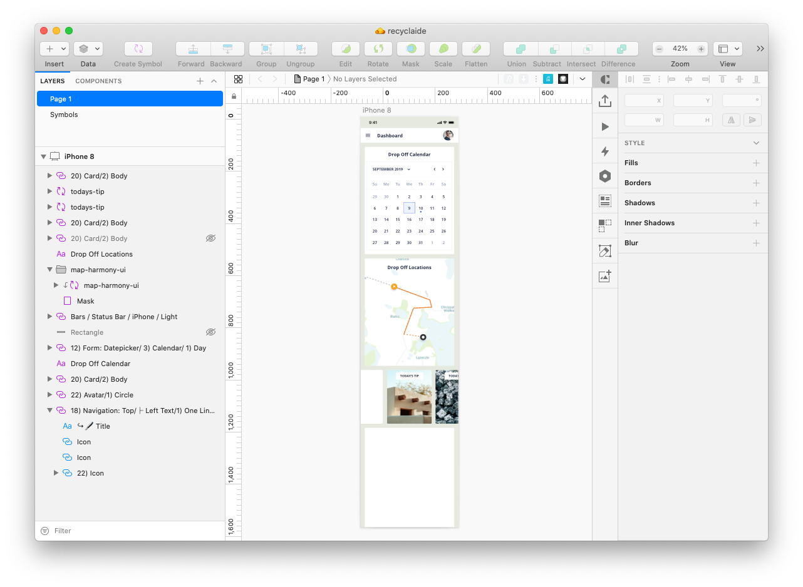

### Moving to Framer X

As I starting getting deeper into the design and thought about prototyping, I decided to switch over to Framer:

- Designing and Prototyping *simultaneously* has become easier for me in Framer as I've learned the tool.  This helps think through interaction design in visual design.
- Framer's close relationship with React meant that developer handoff might be easier down the road.  (I had hoped to import - and even create - actual react components while designing to make handoff even easier, but found working with NPM packages in Framer not as seemless as first thought.)
- Working with real APIs in Framer like [Mapbox](https://packages.framer.com/package/mapbox/mapbox) meant creating almost fully functioning prototypes, which was the ultimate need of the project.

I started off with exploring the basic layout and interactions:

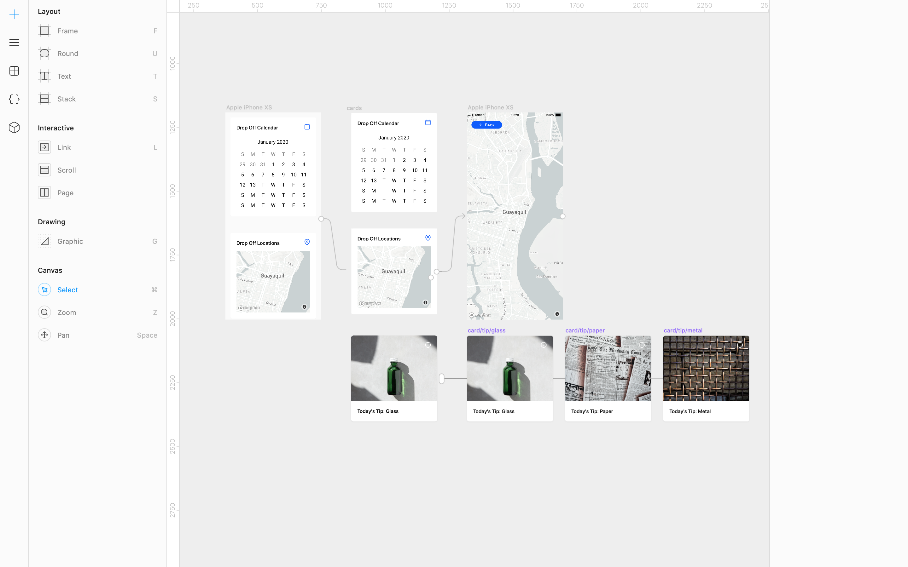

As the design progressed, I prototyped interactions at the same time:

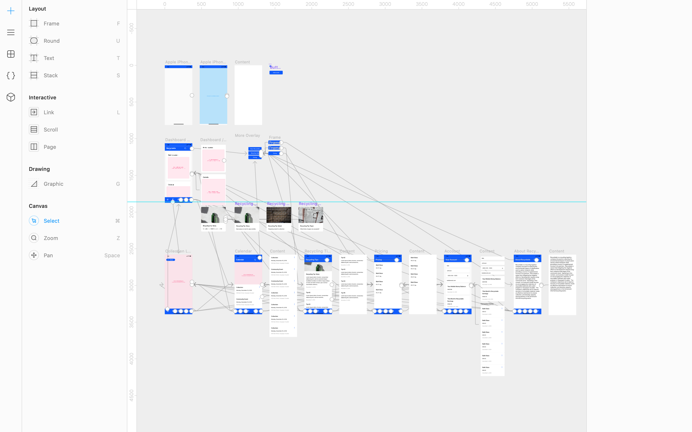

### Working with APIs and JSON

Looking a little closer, here's an example of a mapbox component (in red - the map is generated on prototype preview) and some card components in a scrolling panel:

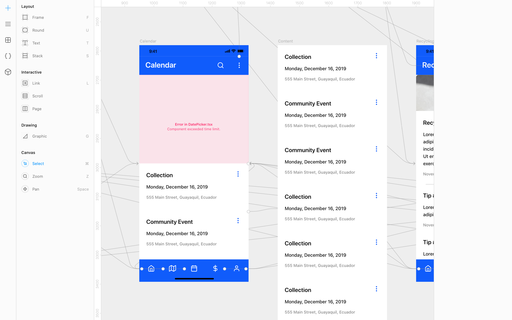

I was able to tweak the Mapbox component in the prototype by opening the Framer file's project folder in VS Code and editing the component's .json:

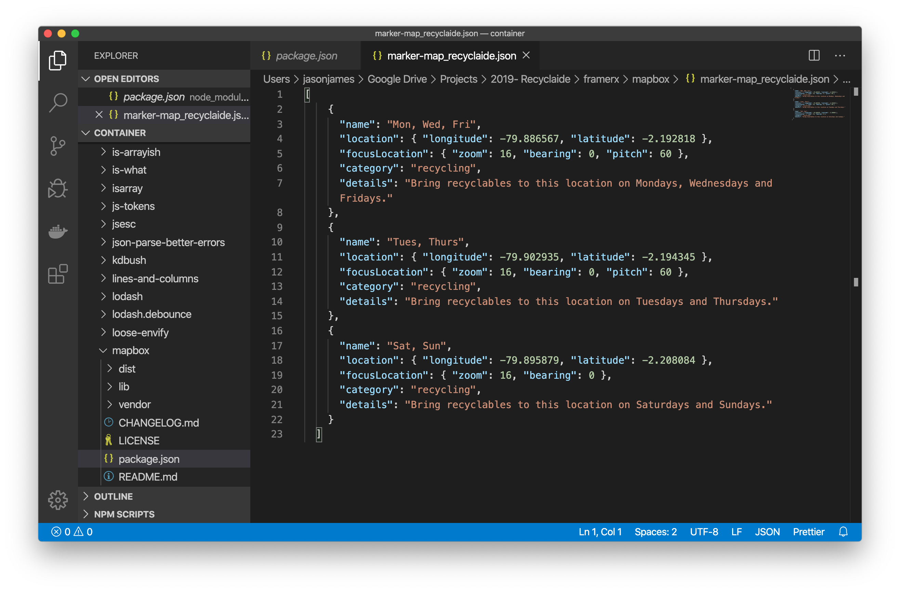

In the image above I'm able to add location points to the map with details for each point.  Here's the .json so you can see it closer:

`"name": "Mon, Wed, Fri",`
`"location": { "longitude": -79.886567, "latitude": -2.192818 },`
`"focusLocation": { "zoom": 16, "bearing": 0, "pitch": 60 },`
`"category": "recycling",`
`"details": "Bring recyclables to this location on Mondays, Wednesdays and Fridays."`

<!-- I'd like to include markdown codeblocks, but I'm having difficulty rendering them with Jekyll.  Will need to revisit.  - JJ 2020-02-11 -->

<!--
```json
[
    {
      "name": "Mon, Wed, Fri",
      "location": { "longitude": -79.886567, "latitude": -2.192818 },
      "focusLocation": { "zoom": 16, "bearing": 0, "pitch": 60 },
      "category": "recycling",
      "details": "Bring recyclables to this location on Mondays, Wednesdays and Fridays."
    },
    {
      "name": "Tues, Thurs",
      "location": { "longitude": -79.902935, "latitude": -2.194345 },
      "focusLocation": { "zoom": 16, "bearing": 0, "pitch": 60 },
      "category": "recycling",
      "details": "Bring recyclables to this location on Tuesdays and Thursdays."
    },
    {
      "name": "Sat, Sun",
      "location": { "longitude": -79.895879, "latitude": -2.208084 },
      "focusLocation": { "zoom": 16, "bearing": 0 },
      "category": "recycling",
      "details": "Bring recyclables to this location on Saturdays and Sundays."
    }
  ]
```
-->

### Thinking Like a Developer

Another nice thing in Framer is that objects are grouped and ordered automatically based on placement in the canvas.  It's like every object is its own `div`.  Put a button inside of a box?  You automatically get:

<!-- I'd like to include markdown codeblocks, but I'm having difficulty rendering them with Jekyll.  Will need to revisit.  - JJ 2020-02-11 -->

`<div id="box"><div id="button"></div></div>`

The IDs are not actually created - I did that for clarity in the example.  

The whole point is to demonstrate the ease of organization in Framer and how we as designers can better think about development *during* the design process.

## Branding

Keeping with the theme of efficiency, I walked the team through a short branding exercise to begin to develop the app - and the companies - brand.  

### Product Reaction Cards

I gave the team product reaction cards for them to select what reactions they want users to elicit from the app.  Here's what the two stakeholders chose (I'm not using names for confidentiality):

Stakeholder 1

- Accessible
- Effective
- Efficient
- Reliable
- Responsive

Stakeholder 2

- Approachable
- Collaborative
- Empowering
- Motivating
- Trustworthy

You'll see there's actually no overlap between the two.

### Brand Personality Cards

Next, we moved onto Brand Personality Cards, there was agreement there.  (1 stakeholder = :white_check_mark:)

- Honest :white_check_mark: :white_check_mark:
- Spirited
- Reliable :white_check_mark: :white_check_mark:
- Charming :white_check_mark: :white_check_mark:
- Tough :white_check_mark: :white_check_mark:
- Imaginative

### Mood Board

Next, we collaboratively created a mood board to help capture the visual direction for the app.  Each team member contributed a few images which were voted on, resulting in:

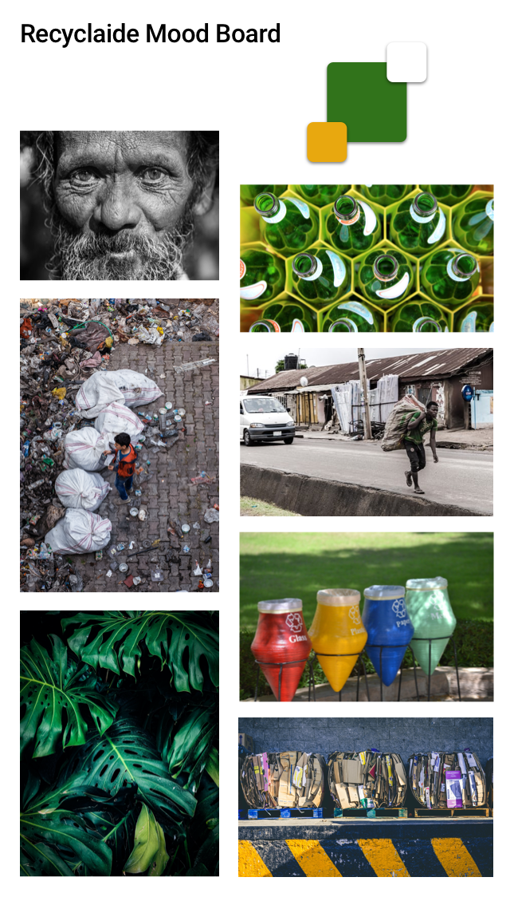

### Branding Next Steps

There is much more work that can be done on branding.  The exercises above we enough to get started, but we'll need to revisit branding in the future.

## Hi-Fi Low Hanging Fruit

With initial sketches, better direction, the chat bot created and branding explored, it was time to bring the prototype up in fidelity.

The resulting prototype is the resulting design as of February 11, 2020.

<!-- I'm including html img tags here to control the height for this image. -->


In addition to the GIF above, you can [download the MOV here](2020-02-11-recyclaide/recyclaide-v4.mov).

## Next Steps

The next steps for the design - and the project overall - will be determined based on business needs.

The prototype can be expanded with additional features and interactivity, but first I'll be helping the team narrow their vision into an MVP that helps meet their needs in the immediate future and will help to minimize the number of design cycles needed now.

I'll also need to revisit the green branding color in light of **accessibility**.  Green can be a difficult color to implement with good accessibility - we'll need to investigate further.

February 11, 2020
