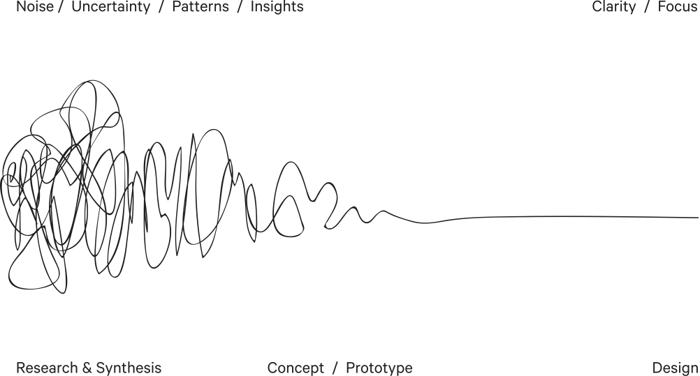

- **Processes:** 
- **Tools:** iA Writer, MindNode, 
- **Technologies:** [Markdown](https://www.markdownguide.org/), 
- **Designed For:** 

<!--

## Quick Notes

- [ ] Name/locate images while you write this article in a way that fixes Jekyll double image storage problem.  
- [ ] Also compare usage of `assets/image.jpg` for example with `` with ``.
- Used iA Writer to write this case study *as I was* building the example.

-->

## Background

As of February 2021, I am currently product owner, curator and semi-developer of Saffie, Safrapay’s chatbot built on the Watson Assistant platform.

### My Role(s) at Safrapay

As a *product owner*, I work with stakeholders to guide the direction of chatbot features and secure resources for the project.

As *curator*, I monitor a custom-built dashboard and the Watson Assistant interface to add to or improve the chatbot’s responses.

I used the term *semi-developer* above because I am not a front-end developer in the fullest sense of the word, but I know enough about conversational design and the Watson Assistant to be an effective bridge between design, business and development.

I collaborated with, was trained by, and have since replaced two front-end developers from IBM on the project.

Now, I create, modify and structure the intents, entities, and dialog that train Watson Assistant’s AI.  (Don’t worry, I explain what these things are below.)

### About Safrapay

[Safrapay](https://safrapay.com/) is a fintech startup based here in South Florida with strong connections to Brazil.  We’re launching this year a payment, banking and credit solution for small and medium sized businesses.

Since we haven’t launched yet (and more importantly because I’m currently working for a bank), there’s not much I can tell you about my work at Safrapay.

Instead, I’m going to be building a new chatbot from the ground up and hope you’ll join me along the way.  🤗

## An Introduction to the Watson Assistant

## Getting Started: The Design Sprint

- Important part of the process
- Includes things like:
- Since I’m building this project on personal time, I won’t be doing any actual research.

https://www.ibm.com/garage/method

## Getting Started: This Project

- Selecting City of Coral Springs: has enough complexity
- Dialog and Actions opportunities
- Two chatbots: one for the city of Coral Springs, one to embed into my Wordpress Site

## Getting Started: Documentation

> The shortest pencil is longer than the longest memory. - ==Unknown==

Documentation is an essential part of the design & development process.  

Before beginning any research, I created a structure for how I wanted to write about this work.  Since I’m starting this project from the beginning, I have the luxury of putting the right processes in place [from jump](https://www.urbandictionary.com/define.php?term=from%20the%20jump).

As a designer, documenting your process along the way provides a living memory to help guide your work.

Sometimes you can get caught down the rabbit hole of a problem that in the larger context is not important.  Referring back to the foundational goals of the project regularly might help keep you on track.

Perhaps more importantly, documentation serves as a record to explain to stakeholders (and your future self) why certain decisions were made.

As a developer, in addition to writing clean and well structured code, documenting your code with inline comments similarly helps explain and remember.  You can also provide additional guidance in external documents like a README.

I wrote about this project in [markdown](https://www.markdownguide.org/).  For more on why, you can read about my love of Markdown ==here==. `insert link`

## Research

<!-- Although it's not listed in Github's markdown documentation, you can not only add alt text, but also titles for images: ``.  Thanks to Stephen (see https://dev.to/stephencweiss/markdown-image-titles-and-alt-text-5fi1 accessed 2021-02-15) -->

*The Process of Design Squiggle by Damien Newman, [thedesignsquiggle.com](https://thedesignsquiggle.com/)*

<!-- Insert content here. -->

### Reviewing the Existing Site

### Conversational Design is Information Architecture

<!-- Insert Mind Map here. -->

I'd likely want to do some sort of card sorting exercise here.

But, unlike static UI such as a screen or webpage, the chatbot will 