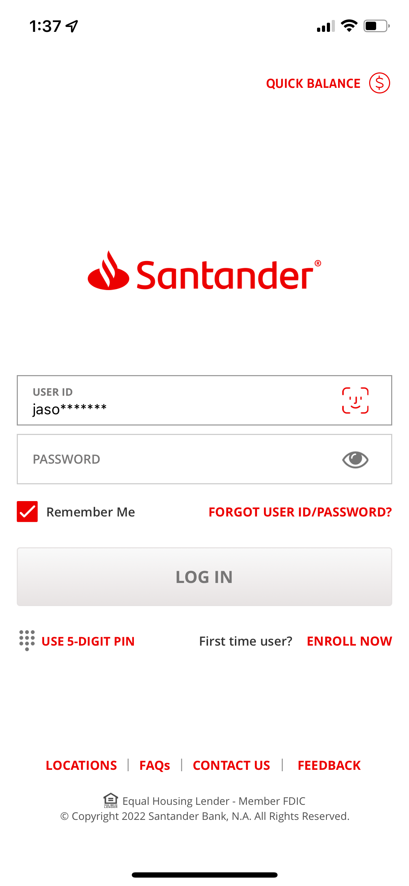
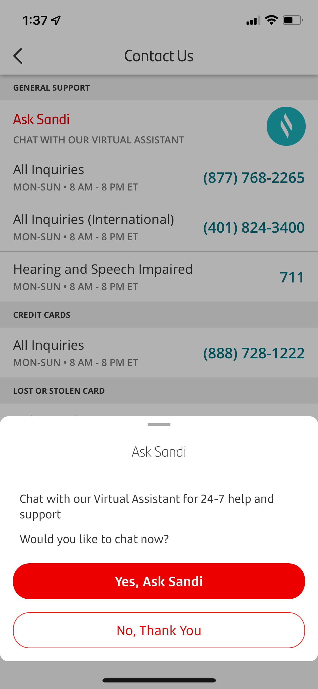

Currently, I’m a (Contract) Senior User Experience Designer at [Santander Bank](https://www.santanderbank.com/), leading conversation design of our virtual assistant “Sandi” for the US team and UX design for the self-service value stream on web and mobile.

Day to day, this looks like solely supporting three development teams with UX research, UX/UI design, and conversation design for web, iOS and Android.

I'm part of a small, but growing design team supporting the larger digital transformation effort for the bank's 2 million + customers in the US.  We collaborate and support each other on a weekly basis and are part of a larger global design consortium for the global bank.

## Day to Day / Day in the Life

### Interface Design in Figma

- Global design system -> US design system
- Mobile & Web
- Investigating APIs when appropriate

### UX Debt

### Cross Functional Collaboration

- PMs, POs, Developers, QA, Legal/Compliance, Business Control, CX, Marketing/Branding
- Product Grooming
- Cross-cultural: collaborating with Global in Spain & the UK

### Agile in JIRA

- Backlog management

### Conversation Design & Expert Review

### Organizational & Systems/Process

- Copy project
- HCST
- Moving towards more and more user flows

See projects below.

<!-- Projects -->

## Projects

- Sandi, the Virtual Assistant: research, conversation design maintenance, improvements and additions
- Sandi, the Virtual Assistant: Entry point UI design for mobile
- Report Your Card Lost or Stolen: UX/UI design for web
- Dispute Tracking: research and UX/UI design for web and mobile
- Transaction Enrichment: research, collaboration, and UX/UI design for web and mobile.

I'll provide more details as each project is released to production.

<!-- 

### Finding UX Debt & Navigating Across the Organization

#### Bottom Sheet Component

- Android, iOS Touch ID & iOS Face ID
- Creating a Base Component
- Thinking through box models and various layouts in Figma to help define requirements documentation.

-->

### Performing an Initial Accessibility Audit of the Virtual Assistant

*Coming Soon*

- High Level Remediation Plan
- Sharing manual testing best practices with the QA team after initial automated testing (with axe DevTools) missed key accessibility violations (innaccessible buttons were divs)
- Communicating virtual assistant architecture to business stakeholders which allowed better clarity for discussing accessibility violation impacts.  Creating a high level user journey to show how accessibility impacts the current experience of the Virtual Assistant.
<!-- Insert sanitized architecture model here -->
- Performing a detailed manual accessibility review using WCAG guidelines as success criteria
- Performing detailed manual accessibility reviews using browser developer tools
- Automated accessibility reviews with free tools: WAVE chrome plugin, axe DevTools
- Communicating accessibility basics
  - "Design/UI issues", "Functional/code issues", "Content issues"
  - New EU requirements to bolster Accessibility important with our European partners.
  - Various accessibility resources and basic principles

### Creating an Accessibility Dashboard with Open Source Tools

*Coming soon.*

<!-- Insert link to post about pa11y -->

### Copy Organization Project

- Utilizing confluence macros and page labels to create a repository with the tools available
- Defining the intake process

### Transaction Enrichment: Giving Clarity to Customers about their Transactions

*Feature not yet deployed to production.*

<!-- 

On Component Construction
- Autolayout: and multiline text fields + packed w/ horizontal autolayout but filled width and autoheight text boxes
- Box model in your design

-->

### Dispute Tracking: Research and UX/UI Design for Web and Mobile

*Feature not yet deployed to production.*

I'm particularly excited to show you how I adapted components in the existing global design system for the US design context and specific project needs.

Stay tuned!

### Report Your Card Lost or Stolen: UX/UI Design for Web

*Feature not yet deployed to production.*

Coming soon!

### Virtual Assistant Entry Point UI Design for Mobile

The screenshots below are taken from the production iOS application.

A key win for the user experience in this project was *not* placing an entry point for Sandi, our Virtual Assistant, on the login screen, which was already filled with a call-to-action and several secondary buttons.

With the support of the Head of UX and using supporting secondary market research and my analysis of user utterances in Sandi (inputted user text), I worked with developers, the product owner, and the product manager, to not add an unneeded entry point.

Sometimes the biggest UX outcomes are about what *doesn't* show up in the UI.

#### Login

 <!-- viewable in github deployed build, image in folder inside of _portfolio with same name as markdown portfolio page -->

 <!-- viewable in local jekyll build, image in folder inside of _portfolio with same name as markdown portfolio page -->

 <!-- viewable directly in markdown -->

<!-- End of Projects Section -->

#### Contact Us, Overlay

<!-- Displaying images with fallbacks using the object html tag.  Thanks Alberto!  (See https://dev.to/albertodeago88/html-only-image-fallback-19im) -->

<object data="/IMG_8549.png">
  
  
</object>

#### Contact Us

#### Account Overview Entry Point

#### Sandi Opened

### Creating Design System UI Components for Sandi

With Figma's Auto Layout, Components and Variants, I created UI components for our design system that are adaptable for a variety of design needs:

- Components that automatically resize horizontally to accommodate mocked text
- Components that automatically resize vertically to accommodate longer strings of mocked text
- Placing components within variants that have multiple properties to accommodate theming.  For example, the same component might be vertically growing and light themed, with a variant that is horizontally growing and dark themed.

Feel free to explore below how these components are put together.

*I'm hosting the components below in a personal Figma instance for security:*

<iframe style="border: 1px solid rgba(0, 0, 0, 0.1);" width="800" height="450" src="https://www.figma.com/embed?embed_host=share&url=https%3A%2F%2Fwww.figma.com%2Ffile%2Fz7NkGZe84Mo55xnN6pUdVn%2FSantander-Portfolio-Pieces%3Fnode-id%3D2%253A24" allowfullscreen></iframe>

## Learn More

- Santander: [Santander Design Manifesto: the nine principles that guide our designers’ work](https://www.santander.com/en/stories/santander-design-manifesto-the-nine-principles-that-guide-our-designers-work)
- YouTube: [DESIGN MANIFESTO, Santander Bank](https://www.youtube.com/watch?v=Fig7C4tWrK8)
- Santander: [Santander releases documentation about new design system Flame](https://www.santander.com/en/stories/santander-releases-documentation-about-new-design-system-flame)
- YouTube: [FLAME: Santander's NEW DESIGN SYSTEM, Santander Bank](https://www.youtube.com/watch?v=GHTAIz4Ie14)
- Santander: [Our Brand](https://www.santander.com/en/about-us/our-brand)

[^1]: [https://www.santanderus.com/about-us/](https://www.santanderus.com/about-us/)