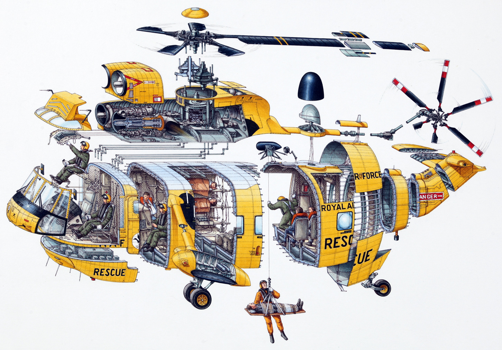

# Cross Sections

*Originally published via Wordpress on January 3, 2018.*
*Last updated November 16, 2019.*

[Stephen Biesty](http://www.stephenbiesty.co.uk/work.html) drew the helicopter cross-section above in a book called [Incredible Cross Sections](https://www.amazon.com/Stephen-Biestys-Incredible-Cross-Sections-Richard/dp/0679814116) that I loved as a kid. It not only showed the inner workings of buildings and machines, but the purposes of people that used them. I've still never ridden in a helicopter, but even as a child I was able to appreciate that although complex, a machine or system that might seem magical is still just made with parts put together. Looking back, I also appreciate that each of Stephen's drawings were not just about the object, but about the purposes people were able to achieve through them, such as rescuing an injured person in the drawing above.

I transitioned into UX (User Experience) Design because it brings out so much of what makes me tick:

## I'm curious about how the world works.

In 2011 I earned a **BA in History** from the [University of Virginia](http://www.virginia.edu/). Good history tells a captivating story by truthfully piecing together details. I wanted to understand how the world around me came to be what it is today in hopes of making it better and in the process learned to really read, think and write for myself. *Good UX is well-researched and my humanities background provides a solid foundation.* 

In 2017 I earned a **Master's Degree in Business** from [Eastern Mennonite University](http://collaborativemba.org/). Like technology, money is a tool, and to really understand how things work, I'd recommend learning how to read a financial statement. Seriously. I also learned how to increase my capacity to serve others through courses like Leadership and Organizational Behavior and perhaps benefitted most from training in sustainability, which at the root is [systems thinking](http://wtf.tw/ref/meadows.pdf). Experiences in the communities I'm a part of and as a professional taught me that there are ample opportunities to attack root problems through business and why I chose a program that not was not only anchored by the [triple bottom line](http://www.economist.com/node/14301663) of people, planet, and profit, but took me [outside of the United States](http://www.coopeatenas.com/) to study cooperative business models. *Good UX looks at business needs, strategy and information architecture systematically.* I love the fact that design deals with both pixel-perfect detail and grand vision.

## I like connecting with and helping others to connect with people.

You might now be asking, why is this guy not a business analyst or operations manager or maybe even a non-profit program manager?

1. Right now technology is perhaps the greatest shaper of society, culture, and increasingly, the economy. UX design is an avenue for shaping the tools we create for the better.

2. Over the past few years I've loved working with and [helping to lead](https://www.greenleaf.org/what-is-servant-leadership/) my colleagues, but I've never wanted to just 'manage' or 'analyze'. What is that anyway? I want to create. I want to change how things are done. I want to leave a legacy.

3. If you pair all of the design tools and all of the frameworks away, UX Design is really about empathy. I love that. I can't believe you can make a living understanding and responding to people's needs. Sign me up.

## I don't want to waste my time on earth. I want to leave a positive legacy. I want to [solve problems](https://ssir.org/articles/entry/wicked_problems_problems_worth_solving).

If systems thinking taught me ['solutions'](https://medium.com/disruptive-design/problem-solving-desperately-needs-systems-thinking-607d34e4fc80) you think up can have serious [unintended consequences](https://www.futurelearn.com/courses/systems-thinking-complexity/0/steps/20396), design thinking showed me a path to begin tackling problems big and small in a creative, pragmatic way that responds to reality.

After working with wireless engineering teams in Spain, Taiwan, and the US as a sales associate and spending four years as project manager [building buildings](http://jasonmjam.es/portfolio-2/my-work-before-ux/), I now build for the web.

I enjoy spending time with the people I love, riding my bicycle, discovering new music, cooking, wrestling with ideas. 

[Connect with me on LinkedIn](https://www.linkedin.com/in/jas0nmjames/) 

P.S. Many thanks to [Steve Nunez](https://www.linkedin.com/in/steve-nunez/) for the photos of me on this page.