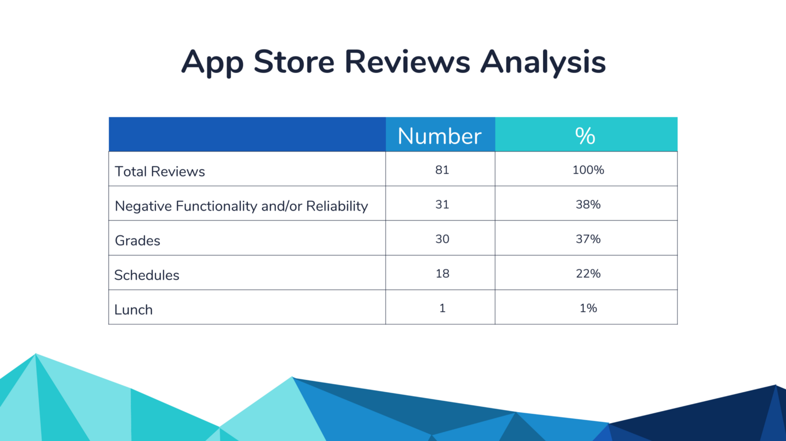

# Miami-Dade Schools Performance Data Redesign

*Originally published via Wordpress on December 28, 2017.*
*Last edit December, 2017.*

#### Ironhack Miami UX/UI Hackshow Award Winning Project (December 2017)

- Overall Hackshow Judge Favorite
- Outstanding UX Strategy
- Outstanding Business Analysis
- Outstanding Problem-Solving Skills
- Outstanding Presentations Skills, Runner Up
- Outstanding User Research, Runner Up

#### Role and Project Duration

I individually designed and presented this project from start to finish over two weeks.

####  

#### I wrote this case study for a wide audience:

I wrote this case study for not only other UX Designers, but for developers, project managers and anyone else that might not yet know the ins and outs of user experience design. I’ve [hyperlinked](https://www.w3schools.com/html/html_links.asp) many terms below to research or further explanation where I thought it’d be helpful.

I wanted to go deep into my process in this case study and it’ll take you about 20 minutes to read in full. If you’re already familiar with the UX design process or are short on time, **I’ve written key insights in bold** and embedded important images and videos that should help you skim fairly quickly.

Thanks for your time, [Jason](https://www.linkedin.com/in/jas0nmjames/)

### Getting Started: The Project Brief

For my final project in [Ironhack’s full-time UX/UI Bootcamp](https://www.ironhack.com/en/courses/ux-ui-design-bootcamp-learn-ux-design), I wanted to solve a problem through design that might have real impact in the local community. Through [Github](https://github.com/Code-for-Miami), I found [Gregory Johnson](https://medium.com/@GregoryJohnson) working to visualize Miami-Dade Public School Data with [Code for Miami](http://codefor.miami/). (Thanks Gregory for taking the time to show me what you were working on.)

Gregory was specifically working on visualizing graduation rates over time at the district level and across demographic groups. After digging into the problem, I found an opportunity to address two larger problems:

###  

### The Problems

#### Problem #1 — DadeSchools.net Cognitive Overload

[Cognitive overload](https://www.nngroup.com/articles/minimize-cognitive-load/) is the term designers and psychologists use to describe what happens when a person is presented with too many options, choices or too much information. [Research has shown](http://www.nytimes.com/2010/02/27/your-money/27shortcuts.html) that too many choices can actually lead to dissatisfaction. (FOMO — or Fear Of Missing Out — really is a thing.) **Good design provides the straightest path possible for a user to accomplish their goal** and that’s exactly what the current (December 2017) [Miami Dade Schools website](http://www.dadeschools.net/) gets in the way of:

Imagine you’re a new parent trying to find out how Miami Dade School are performance. [Feel free to open a second tab and navigate with me to http://www.dadeschools.net/.] There are already some issues on the homepage, but we’ll skip discussing them for now by clicking on the ‘parents’ page in orange. We’ll find:

Miami Dade Public Schools parents page (http://www.dadeschools.net/parents.asp) as of January 2018.

Even before testing, **there are enough items on the page to make an educated guess that at least one user will experience cognitive overload**. Also, I’m not exactly sure how to find school performance data from here. Now let's say you do find how to navigate to the school performance data page (I can never remember how to find it so I search for it directly from Google.):

http://oada.dadeschools.net/ as of January 2018

*If you were looking for schools data, where would you click?*

In the menu on the left, there is “School Performance Data”, “Statistical Highlights”, “School Performance Grades” and “Progress Monitoring School”. The green, orange and yellow buttons at page center link to “School Performance Grades”, “FLDOE School Grades and AYP” and “Adequate Yearly Progress Status by School”. There are also links to “2016–2017 Performance Grades” in blue. More cognitive overload.

If these sites are meant for the general public to access, there’s a steep learning curve if you’re unfamiliar with how data is spread across the site. And if it’s meant for professionals only, **there’s no good reason to locate and label performance data in so many different ways and places**.

####  

#### Problem #2 — Presenting the Data

If you click on the link titled ‘2016–2017 Preliminary School Performance Grades as of Nov’, you’ll download the following excel file:

http://oada.dadeschools.net/SchoolPerformanceGrades/SchoolGradesDade1617asofNov.xls

Now, in all fairness, there are [Statistical Highlights](http://drs.dadeschools.net/StatisticalHighlights/SH1617.pdf) available for each year that attempt to summarize the data in a several page PDF document. But really, as a parent or member of the general public, neither the highlights nor the excel spreadsheet present the performance data in an easily consumable way.

Finally, **we can’t forget about what a user’s experience might be on mobile device**, especially considering the prevailing ‘[mobile first](https://www.lukew.com/resources/mobile_first.asp)’ approach to web design. Let’s try it out:

On the left, DadeSchools.net on a Galaxy Note 8. On the right, the first screen presented after opening the Dadeschools Mobile Android App. (Screenshots taken December 2018)

As shown above, there is no mobile site — **there’s only viewing a page designed for desktop on a mobile screen**.

*But wait!*, you say. *There’s a link to download a mobile app!* However, once downloaded and installed, **the app requires registration before displaying any actual information**, let alone school performance data.

### The Solution

High Fidelity Prototype designed mobile-first for the responsive web: on mobile (Galaxy Note 8 here), tablet (iPad Air 2 show here) and Desktop.

Through research, ideation, and testing, the solution:

1. Accounted for users interacting with the site on multiple devices with a mobile-first, responsive web design.
2. Solved cognitive overload problems by simplifying and reorganizing the sitemap around [user flows](https://cdn-images-1.medium.com/max/1600/1*2nsBqT_TeNJJo4vus3gmuQ.png).
3. Data presented in clear, graphical format with additional interpretation to aid in user understanding and trust.

View this **[walk-through of the InVision prototype.](https://www.youtube.com/watch?v=EUcs9JS-LiQ&t=10s)**

------

Now, onto the process!:

1. Research.
2. Ideate.
3. Test.

Then repeat, repeat and repeat!

###  

### Research

####  

#### Background Research

I’ve already shared with you some of the problems I found while researching DadeSchools.net, but it wasn’t all bad. It was pretty straightforward generating a [map of schools near an address](http://www.dadeschools.net/guidek-12/default.asp) and then pulling up, although missing school performance data, [details about the school](http://www.dadeschools.net/schools/schoolinformation/school_details.asp?id=6361), such as address, district and lunch menu. Nevertheless, even in the school details I just linked to above, the hyperlink to the school’s homepage is broken.

***Why such a cumbersome site?\*** Why is the Schools Superintendent’s separately designed page [clean and responsive](http://superintendent.dadeschools.net/) and the main site isn’t? Taking a step back, we have to remember that we’re dealing with quite a sizeable organization. One of my takeaways from the [documentary](https://www.youtube.com/watch?v=9I-Y6VQ6tyI) Design Disruptors is how the head of design at Salesforce.com talks about designing for large enterprises: she keeps in mind that **big enough changes might require millions of hours of retraining** — and the related costs — for an organization. As the United States’ fourth largest school system with a [$5,000,000,000](http://www.miamiherald.com/news/local/education/article163868188.html) (yes, that’s *five billion with a B*) [annual budget](http://financialaffairs.dadeschools.net/ES17-18/ES17-18.pdf), 392 schools, 345,000 students, and 40,000 employees, it’s quite a large ship to steer with numerous stakeholders, including those in the wider community, like parents and concerned citizens. It doesn’t mean we should limit the possibilities of what we can design, but it does mean we need to remember potential pain points for not only the users but also web administrators. It also means **designing a MVP (**[**Minimum Viable Product**](https://theblog.adobe.com/move-quickly-design-effectively-when-a-minimum-viable-product-mvp-becomes-a-ux-designers-best-friend/)**), that can be implemented considering the existing technological and organizational constraints and expected level of effort.**

####  

#### User Research: Interviews and Surveys

The foundation and benefit of the [user centered design process](https://www.youtube.com/watch?v=Wl2LkzIkacM) is that we base everything we do, not on what we think is a good idea or a good looking design, but according to user preferences. User Research seeks to understand a user’s [behaviors, needs and motivations](https://www.usability.gov/what-and-why/user-research.html) before we start any designing. There are several ways to conduct user research — I interviewed and surveyed.

#### **User Interviews**

Based on my background research, I knew that my target demographic (the type of people who would likely be users) were parents and students and sought out [five individuals](https://www.nngroup.com/articles/why-you-only-need-to-test-with-5-users/) who were in that demographic. After preparing a few starter questions, I spent about 20 minutes with each either in-person or over the phone [trying to get to the root](https://hbr.org/2012/02/the-5-whys.html) of their current observations, needs and paint points.

**I then reviewed my notes and organized them into a table to better view findings across all five interviews:**

 

The first page of my interview findings

I already had some good insight — for example, 60% of interviewees sought information about schools via word-of-mouth in the community. When digging deeper, they told me they did so because they trusted others in their family, neighborhood or social circles over many other forms of getting information. Definitely something to keep in mind as I moved forward.

#### **User Surveys: In this case, an exercise in mining data**

Although surveys and interviews can be done simultaneously, I’ve found it helpful to have my interviews completed before I begin surveying, so that I can use what I’ve already found to inform how I create the survey and in-turn better validate my interview findings.

For this project, I had an interesting problem. I wanted at least 150 survey results, yet my timeline was limited — I only had two weeks from inception to completion. However, I was working with an existing product (Miami Dade Public Schools) with existing reviews of the school system in general, as well as existing reviews of its own Apple and Android apps. **Instead of creating an entirely new survey, why not leverage the feedback that was already there? But how?**

 

Reviews from the Dade Schools Mobile app in the iTunes App Store (https://itunes.apple.com/us/app/dadeschools-mobile/id820399142?mt=8)

*Resourcefulness is the best resource.* The Dade Schools app [in the app store](https://itunes.apple.com/us/app/dadeschools-mobile/id820399142?mt=8) only showed a few recent reviews. I needed them all and I didn’t have easy access since I wasn’t the developer of the app. I found posts on both [Stack Overflow](https://stackoverflow.com/questions/16273306/how-to-get-app-reviews-from-itunes)and [Reddit](https://www.reddit.com/r/iOSProgramming/comments/5qjglf/rss_feeds_for_app_store_reviews_are_not_working/) that showed me how to access all of the reviews as an [XML document](https://itunes.apple.com/us/rss/customerreviews/id=820399142/sortBy=mostRecent/page=1/xml):

 

**I now needed this in a format I could work with.** With some data analysis experience I could’ve taken the time to parse this in Microsoft Excel, but [found a shortcut to do this for me (for free!)](https://conversiontools.io/conversion/convert_xml_to_excel):

 

And finally, I needed to collect insight. I had about 500 reviews to go through. If this was a larger data set, I could’ve employed some machine learning ([You can use Excel!](https://www.amazon.com/Data-Smart-Science-Transform-Information/dp/111866146X)) that could, with some trial and error, eventually start to pull out data I was looking for. But, considering I only had time to do it once, I decided to read and summarize each review line-by-line to make sure I could get the insight I needed:

 

For example, in row 77, the comment is “HI YEAH PALM SPRINGS MIDDLE SCHOOL AND I NEED MY SCHEDULE, OK THANKS BYE”. With an “x” in column L, I noted that this reviewer wanted to be able to view schedules in the app. This was a great way to pull out pain points and opportunities from a lot of data.

I gained a few key insights about user experiences with the current app, namely that there were plenty of issues with functionality and reliability and that students and parents wanted to see grades, scheduling, and lunch menu functionality either added to or improved in the app:

 

I carried out a similar process to mine [data from another site, Niche.com](https://www.niche.com/k12/d/miami-dade-county-public-schools-fl/reviews/), which had detailed reviews about the school system itself:

 

and similarly cleaned and analyzed the reviews to find:

 

I noted if a particular topic was mentioned in a comment, whether good or bad, as insight into what kind of school information users were looking for. For example, there were more comments about food than I expected. In this case, users (especially students) think that a high quality cafeteria experience is part of a high quality school experience. So we need to factor that into what kind of information is available on the site.

####  

#### Competitive Analysis

Next, we take a **look at direct and indirect competitors to find best practices** on what already works well in the industry, what works well elsewhere that could perhaps be adopted here (innovation!) and the resulting opportunities and threats. For my business & marketing friends, this is basically a **SWOT Analysis** ([Strengths, Weaknesses, Opportunities and Threats](http://www.quickmba.com/strategy/swot/)) at the design level (ex: ‘Using an introductory video to present this type of service is great!’ or ) and at the market level (ex: ‘There is no mid-price offering in this market segment.’) Highlights of this analysis include:

Schoolgrades.org had an excellent way to communicate school performance across districts via color on a map:

Greatschools.org interpreted the data in a straightforward way. In the example below, not only are test scores noted as “a worrisome sign” with an explanation, there are also “parent tips” on how to take action:

 

 

I discovered this feature of an indirect competitor through the recommendation of one of my User Interviewees! As a ‘socially responsible online investing’ service, at on-boarding Censible users answer questions to determine their values, which are in-turn incorporated into their investment strategy. The key for us is Censible’s process of sorting information and the user’s experience based on their preferences. In our context, we could change what type of school performance information a user views based on their preferences:

 

####  

#### Business Analysis: Market Positioning Insight

Based on our user research and competitive analysis, we put our product manager hat on for a moment and look at how to best position our product in the current market. For this project, I determined three things the redesigned site needs to accomplish:

- It needs to **Build Trust.** 60% of those interviewed go to the community first for their information. The power of social feedback is clearly seen with the popularity of product reviews on sites like Amazon or Yelp. Perhaps we incorporate some sort of reviews feature on the site, while **never forgetting that social sharing of information also happens offline**.
- Build a **Modern User Interface (UI)**: We want our site to look like it’s been designed for today, which means a more clean and minimal interface that limits cognitive overload. **This will help address the 38% negative reliability experiences we found** in our Apple App store user research and is **also based on design best practices** as well as the UIs we found during our competitive analysis.
- **Customizable**: It was clear through interviews and review analysis that while there are some commonalities, different users want to see different types of school performance data. One indirect competitor (Censible) showed as a way of doing this well.

> How do I know a school hasn’t paid off one of these third party sites to get a better rating?

- **Take advantage of opportunity**. You might be wondering why we would improve DadeSchools.net at all if parents can go to some of the third party sites I noted during my competitive analysis that are already designed so well. I found in my user interviews that 40% of users were suspicious of school performance data (which was another reason why they trusted those in the community.) One user stated: *“How do I know a school hasn’t paid off one of these third party sites to get a better rating?”* Information on DadeSchools.net is from an official government source that **provides credibility** and in addition provides an opportunity for **direct communication with stakeholders for feedback and improvement**. If you see poor ratings on a third party site, how do you as a parent get involved to help make an improvement?

####  

#### Personas

As we move into the end of the research phase, we use what insight we’ve gained to begin defining who exactly our users are and what sort of features they’re looking for. To do this, we condense our research into ‘[personas](https://www.interaction-design.org/literature/article/personas-why-and-how-you-should-use-them)’ that represent our target users to help orient our design process around user needs. I created primary and secondary personas:

 

Persona photo by [Alexander Dummer](https://unsplash.com/photos/UH-xs-FizTk?utm_source=unsplash&utm_medium=referral&utm_content=creditCopyText) on [Unsplash](https://unsplash.com/?utm_source=unsplash&utm_medium=referral&utm_content=creditCopyText)

 

Persona photo by www.defense.gov

####  

####  

#### Storyboarding

A user doesn’t exist in a vacuum. [Storyboarding](https://medium.com/atolye15/what-is-storyboarding-in-ux-design-and-how-can-you-create-them-effectively-df3712626a22) helps place the persona in a larger context:

 

My storyboard for persona #1

Now you can see that I’m not a fantastic freehand drawer, but that’s okay! The point is to convey information and get it down on paper. **A storyboard is not showing a user navigating your website or app. A storyboard puts the user in a context meaningful to them in which the product you’re designing becomes useful.**

 

My storyboard for persona #2

For persona #2, I captured [a very real situation](https://www.orlandoweekly.com/Blogs/archives/2017/11/28/thousands-of-students-from-puerto-rico-have-enrolled-in-florida-public-schools), in which ‘Juliana’ and her family recently relocated to Miami to stay with family after Hurricane Maria. New to the area, Juliana, might not be familiar with Miami-Dade Public Schools and would be looking for information about her son’s new local school. **Again, it’s not about the user navigating a feature you designed, it’s about how they would use your design to solve a problem in their life.**

####  

#### Task Analysis

Now we start digging into what specific tasks a user would need to carry out to meet the motivations, needs, and goals expressed in the storyboard. We’re still not yet thinking up solutions or actions that would specifically carried out in what we’re designing. If in the storyboard we noted the user would “want to find out how well their school is performing”, in the task analysis we note that the user will “search their schools name using Google search engine” or “talk to neighbor about their experience at the local school”:

 

Before doing task analysis, I find it helpful to review all of the primary research (interview notes, survey responses, etc.) as well as the analysis we completed to be sure our task analysis is research-based.

####  

#### User Journey Mapping

A user journey map is essentially a storyboard at a more granular level. We combine the personas, storyboard and task analysis into a map of how a user would experience trying to complete tasks given the current situation, before our design solutions are applied:

 

Again, my handwriting doesn’t have to be the most beautiful in the world to convey the information I need to analyze and ideate.

If storyboarding shows a user walking to the grocery store to buy groceries because they’re hungry, a user journey map shows them leaving their house, turning left on Elm Street and turning right on Main Street. It would also show them walking the aisles to find groceries, checking out and carrying the groceries home in a bag.

What’s helpful about this activity is that we begin grouping tasks into different categories of goals and motivations and we are able to better analyze user pain points and potential opportunities.

**Key insight so far:**

- Google.com is the likely start of the journey.
- How to leverage existing parent communities?
- Design with those unfamiliar with US school systems in mind.
- Tracking a specific student’s data is part of the context for overall school data.

### Research + [Ideation](https://www.interaction-design.org/literature/article/what-is-ideation): Information Architecture

When you see ‘ideation’, think disciplined brainstorming and creativity. We’re not just tossing around ideas to see what sticks. We’re using our research, good design practices, and what works elsewhere, to generate a potentially novel solution for the problem we’re trying to solve.

I titled this section as both Research and Ideation, because in addressing Information Architecture (IA), you’re doing both.

Here’s where we begin to pivot from researching into coming up with solutions that solve problems. **The reason why we’ve waited so long to begin coming up with ideas is because we want our designs to be as research-based as possible.** It’s incredibly tempting to just start drawing a cool app, especially if you’re skilled at interface or graphic design, but there’s great benefit in taking the time to follow the process. When I worked in construction, there was a saying:

> There’s never enough time to do it right, but always enough time to redo it.

People will complain that they need to cut corners in order to complete a task on time or within budget, however they always find the time to redo the work when errors are found. And it’s painful. Why not do it right the first time and spare yourself the trouble (and wasted time and expense)?

####  

#### Card Sorting

Card sorting with five people allows us to understand how users name and group different content on our site. For this school performance data project, a great place to start were terms used on the existing site. Are the terms easily understood? Do they mean different things to different users? Do they make sense within a larger context? Is there content missing that are research showed we needed?

 

**Key insight from card sorting:**

- Cognitive overload confirmed by users.
- Group informational pages together, for example, make one page for school performance and student information.
- Group student wellbeing information together, such as bullying, food, health and safety.

####  

#### Site Mapping

In a guest lecture, Milan De Vito, VP of Experience & Design at [Wrecking Ball Studio + Labs](http://getwrecked.com/), showed our cohort [**MindNode**](https://mindnode.com/)**, a great tool to map ideas and sites.** (Thanks Milan!) It seems like new tools are being developed every week and it’s important for designers to stay up-to-date on what works. I loved MindNode, so I downloaded it and got to work!

Here’s what the existing site architecture is for DadeSchools.net and http://oada.dadeschools.net/, as I mapped out in MindNode:

 

And here’s how, using research findings, card sorting results and best IA practices, I redesigned the architecture:

 

Now, to be fair, I haven’t added as much detail here. I don’t note the five or so sections of content that would be listed in the Employee’s ‘Human Resources’ page under ‘Discover M-DCPS’, but I don’t need to. **I demonstrate here a great improvement on how much information is presented to a user as they begin navigating the site.**

####  

#### User Flow

And here I show how a user would navigate this new architecture to perform a task, in this case to find school performance data:

 

Since our research showed a user would likely start with a search in Google, we begin there and depending on how they search, follow one of two paths to get to “2017 School Grades”, the user’s goal in this scenario

###  

###  

### Ideation

Now that our IA is straightened out, we can begin designing screens (pages) of our site.

####  

#### Feature Prioritization

After all of the research documented above, we need to first figure out what we can actually incorporate into the design.

Since I’m on a two week timeline (and by now have about one week left), I need to figure out **what features I must, should, and could have**. ([MoSCoW](https://www.agilebusiness.org/content/moscow-prioritisation-0)!):

 

The features I must have will be incorporated into the [minimum viable product](https://www.techopedia.com/definition/27809/minimum-viable-product-mvp) I’m completing design on over the next week. Ideally I can also incorporate some, if not all, of the should features. The could features are the most time-consuming, expensive or simply non-essential and can be incorporated into the design at a later stage in development.

####  

#### Ideation: Crazy 8s

At this point it’s important to note that in design, there are many ways to accomplish a task. For example, I could’ve used a User Scenario instead of a Storyboard. (hint: they’re very similar) . The goal is to apply a particular tool or framework to find a solution in the best way possible.

(I had the privilege of studying under Maite Rodriguez who [recently published some fantastic UX design guides that break down tools at every stage in the process](http://maitedalila.com/).)

To explore how features could be implemented in my redesign, I did a few [Crazy 8s](https://www.iamnotmypixels.com/how-to-use-crazy-8s-to-generate-design-ideas/), one of design exercises I could’ve chosen:

 

Crazy Eights: Spend five minutes drawing eight different ways (that’s 40 seconds a way) a feature could be implemented. Review what you have, then do crazy eights again, refining what you’ve come up with.

Paper is great. We still haven’t moved to digital design because we can toss around a lot of ideas very quickly. We can throw out ideas and add new ones just as fast.

Finally… it’s time to prototype.

### Testing Prototypes: From Low to High Fidelity

 

My first screens for this project, hand-drawn and uploaded into the Marvel App

**I** [**wireframed**](https://www.uxpin.com/studio/ui-design/what-is-a-wireframe-designing-your-ux-backbone/) **my first screens on paper, which allowed me to make a quick working prototype in** [**Marvel App**](https://marvelapp.com/)**.** Using the ideas I sketched in the Crazy Eight exercise as groundwork, I sketched the foundation of the responsive, mobile-first site, considering the new sitemap (information architecture) I had designed.

From here, I’m going to use a single screen — School Performance Data — to show you how the design developed from low to high fidelity based on user testing feedback:

####  

#### Version One: Low Fidelity Wireframe on Paper

This is the school performance data screen shown above as uploaded into the Marvel App:

 

This is the school performance data screen shown above in the Marvel App.

#### **User Testing**

In order to ensure that user testing would be as unbiased as possible, I prepared a script that I would read to each tester before beginning. I asked each a few questions about their existing experience viewing school performance data — similar questions I asked during user interviews at the beginning of the project.

I then explained how the test would be conducted, that there were no right or wrong answers, and the following **scenario**:

1. *You’ve navigated to the dade schools website, what you’ll see is the first screen. You’re using your phone. This site is also available on a tablet or desktop.*
2. *You’re trying to view school performance data. In other words, you’re trying to answer the question, are the schools good?*

During testing I would interfere only to ask questions of the user to get to the heart of their experience. (It’s rare a first response probes deep enough. **Ask “why?” again and again. See ‘**[**the five whys**](https://en.wikipedia.org/wiki/5_Whys)**’.**)

Finally, I would encourage the tester to be as vocal as possible and to let me know their observations, reactions, feelings, and general experience.

####  

#### Version Two: Mid-Fidelity Prototype in Sketch and InVision

After testing with five users, I gathered insight and finally moved to digital design. At this stage I added more detail without adding color and was already responding to usability feedback; for example, on this data screen, 80% of testers had trouble differentiating between what was County level data and School level data. In response, I added the search box to find a specific school that was on a different screen in version one, to this screen in version two. See how this change and others were incorporated below:

 

I then created a clickable prototype in InVision and again tested five users.

####  

#### Desirability Testing

Before designing version three in high fidelity, I needed to design and test typography and color as they determine not only if something looks good, but carry emotion and meaning. To do this, I first created a mood board:

 

The mood board collects images, textures, text and colors of what we’re trying to design. I chose three [Brand Personality](http://www.valuebasedmanagement.net/methods_aaker_brand_personality_framework.html) adjectives that I was trying to communicate with the design based on my research and target audience:

- Honest (because I want to address data trust issues)
- Reliable (because I want to address past reliability issues)
- Up-to-date (We’re designing for a school system

I then created a style tile that would serve as a template for my design:

 

Style Tile

**All of the colors had meaning:**

- Yellow to convey warmth, freshness and energy. (As well as cues to the local school bus!)
- Blue to convey imagination, trust, and intelligence. (As well as to match the existing site and logo’s blue base.)
- White to convey cleanliness, softness, and new beginnings. (As well as to match the existing white background.)

**I also used** [**material design**](https://material.io/) as a base because the format of organizing content by cards was so useful in solving the data presentation problems. Material design was of interest to Gregory at Code for Miami, a stakeholder in the design.

**I then showed only the style tile to five individuals and asked them to select three adjectives from the full list of brand personality objectives.** If they selected the same adjectives I was going for, we were going in the right direction, and they did:

- HONEST: ✓✓✓ + ✓ (SINCERE)
- RELIABLE: ✓✓✓
- UP-TO-DATE: ✓ + ✓ (YOUNG) + ✓ (FAMILY-ORIENTED)

For example, three testers said the design was “honest” and a fourth noted it was “sincere” which in my analysis I counted as similar to “honest”.

####  

#### High Fidelity

I now not only incorporated color, but address further usability issues I found when testing version two. **For example, 80% of users found it annoying to have to scroll all the way back up to the top from the bottom of a long page, so I had a scroll-to-top button:**

 

####  

#### High Fidelity: Expert Analysis

You’ll notice that version four below is almost exactly the same as version three, except with deeper colors.

After consulting with colleagues, I darkened the blues and yellows and added back in the grey background I had in version two because I wanted to better match the existing site (DadeSchools.net) colors and give a fresher design:

 

I was still able to convey the emotions I was going for while freshening up the design a bit.

If there’s one thing I’ve learned about design, it’s that a good designer asks for and incorporates feedback again and again.

### The Final Product

 

High Fidelity Prototype designed mobile-first for the responsive web: on mobile (Galaxy Note 8 here), tablet (iPad Air 2 show here) and Desktop.

[gallery ids="356,349,362,363,358,354,352" type="rectangular"]

View this **walk-through of the InVision prototype:**

[youtube https://www.youtube.com/watch?v=EUcs9JS-LiQ?rel=0]

### Next Steps

Within the agile methodology, we want to tackle the low-hanging fruit first: we move from implementing low-cost, high-impact features to high-cost, low-impact features. Here are a few features I’d like to implement in the next iteration:

- Build out community conversation / reviews page.
- Connect real data to design: begin designing backend.
- Build out ‘find your school’ and mapping functionality in design.
- Build out Spanish language version in design. (If you didn’t catch it, I’ve already designed a language option at the top of the home page, I just need to translate the screens I’ve designed into Spanish and Creole. I couldn’t believe the existing Dade Schools website didn’t have a language option or at least one that I could find!)

I also received some valuable feedback from [Andy Schultz](https://ats007.wixsite.com/andyschultz) and [Alfonso Martinez](https://www.youtube.com/watch?v=jtUoiXrNa-A) during the December Ironhack Hackshow that suggested I revisit how I displayed performance information using material design cards as a base. Even more steps can be taken to limit cognitive overload and I can also revisit the “back to top” button as it takes up valuable screen real estate.

I’m excited to incorporate this feedback into my next design update and will be posting the results here once completed.

###  

### Thanks

Thanks for taking the time to read (or skim!) this case study. I took the opportunity to go through my user experience design process in-depth so that you could see how a project like this evolved step-by-step over two weeks.

If you want to learn more or just connect in general, please leave a comment below, [view my portfolio here](https://jasonmjam.es/) or [connect with me here](https://www.linkedin.com/in/jas0nmjames/).

 