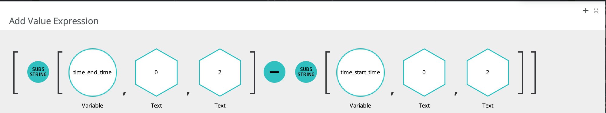
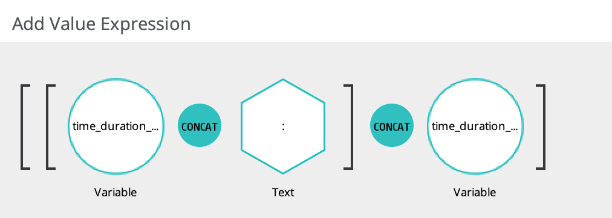
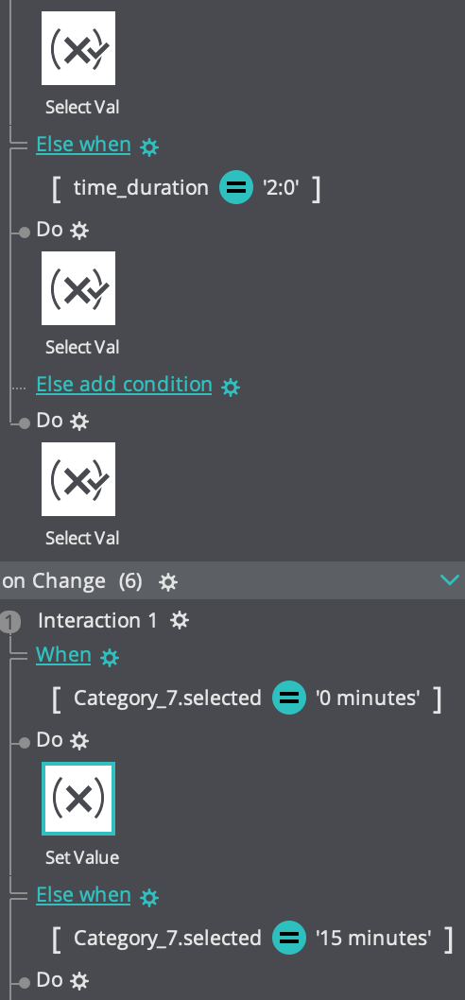

# Advanced Prototyping

*Originally published via Wordpress on December 28, 2017.*
*Last edit TBD.*

Much of my work in 2018 has been under NDA and I won't be able to walk you through the design process. However, I wanted to share with you an example of the sort of advanced prototyping I've had the opportunity to put together in [Justinmind](https://www.justinmind.com/). I received helpful pointers from others (thanks!), but largely learned through exploration and self-teaching.

This is a simple meeting duration selector, but there was no pre-built widget to calculate the difference between two times. Furthermore, I needed the pre-set durations list to impact the start and end times, and vice versa:

In order to make it work, I pushed the start and end times to variable fields if their inputs were changed and then separated the hours and minutes from each other so I could calculate the duration properly:

I then pushed those results into new variables and then stitched them together to display the duration properly:

If the new duration matched a preset duration (i.e. 30 minutes, or 1 hour), I displayed it. Furthermore, if a preset duration was selected from the dropdown, I changed the end time to match:

 

I've left out quite a bit on how all of the variables were tied together and which conditions would trigger a recalculation on one side of the equation or another, but the point is to demonstrate how it's possible to create an essentially fully functioning prototype for user testing.

In some cases, it may not be worth the time to build something of this detail, but these same techniques can be used for something as simple as redisplaying on one screen a first name that a user typed on another screen in the prototype.

The ability for a user to input and interact with real data during testing or a product demonstration can positively impact product design and development and is helpful to have in the toolbox.