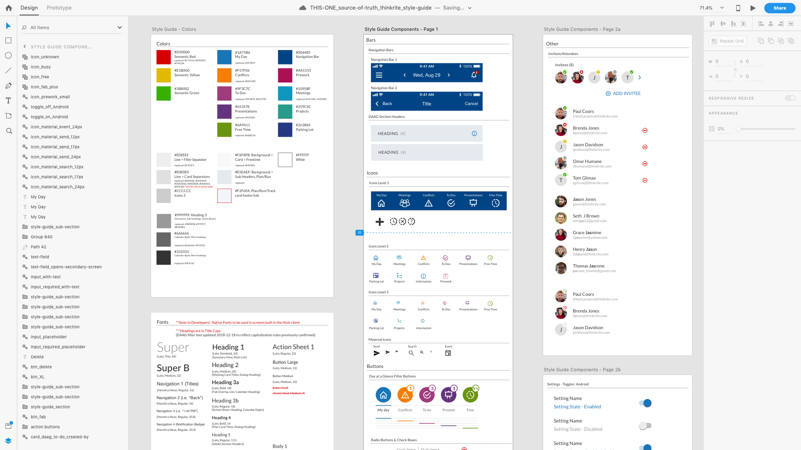
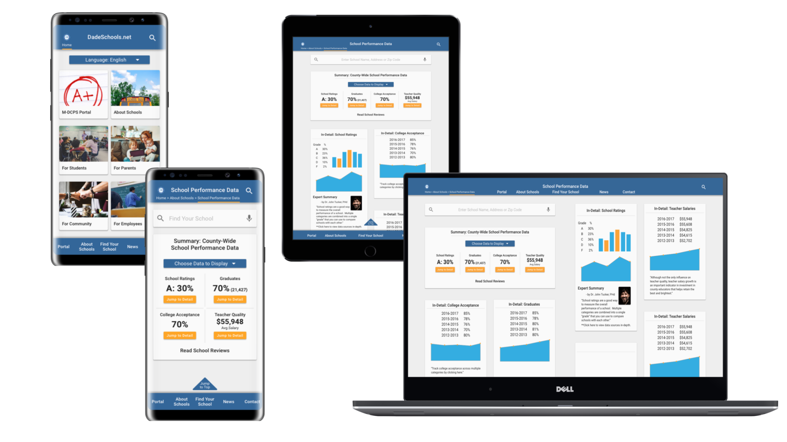
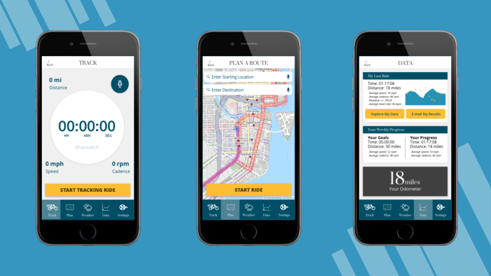

# Portfolio

## Cross.Team: Project Benji

*Case Study Coming January 2020.*

## Thinkrite: Style Guide & Design Systems

I previously wrote about building a Design System in Sketch for my own [BloomBox project](/portfolio/2017-12-28-bloombox.md).

Although I can't take credit for the overall visual design here (a UI designer was on the team), I rebuilt every component within XD and created nested symbols that could accept design changes across multiple components, screens and files.

## Thinkrite: Advanced Prototyping

Much of my work in 2018 has been under NDA and I won't be able to walk you through the design process. However, I wanted to share with you an example of the sort of advanced prototyping I've had the opportunity to put together:

## Miami-Dade Schools Performance Data Redesign

Project Awards (December 2017 Ironhack UX/UI Hackshow):

- Overall Hackshow Judge Favorite
- Outstanding UX Strategy
- Outstanding Business Analysis
- Outstanding Problem-Solving Skills
- Outstanding Presentations Skills, Runner Up
- Outstanding User Research, Runner Up

Improved the Dade Schools site's overall information architecture to reduce cognitive overload and emphasized making school performance data more accessible to the public with a mobile-first design.

In other words, the site became much easier to view on mobile phones and users could more easily find what they were looking for without getting overwhelmed. The site was now built for not just school administrators, but parents and community members too!

## Bloombox

Design Sprint > Design System > High Fidelity Interactions

## Wellness Cycling App

Solving user pain points by helping to cut through traffic figuratively (so many cycling and fitness platforms!) and literally.

## Other Work

### Project & Product Management

*Coming January 2020.*  I'll detail working with developers, quality assurance, and product owners across internal and external teams, locations, and rhythyms....

### Data Analysis & Visualization

Data Visualization can be an incredibly useful tool to discover insights in user testing data and in business analysis in general. When done right, the data is plain for all to see and can help avoid lengthy, subjective arguments.

